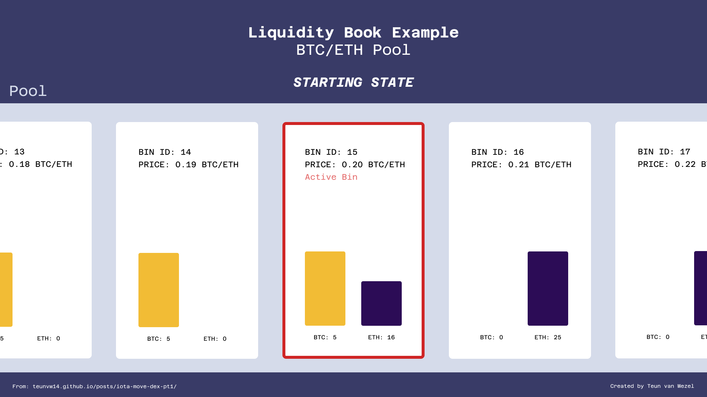
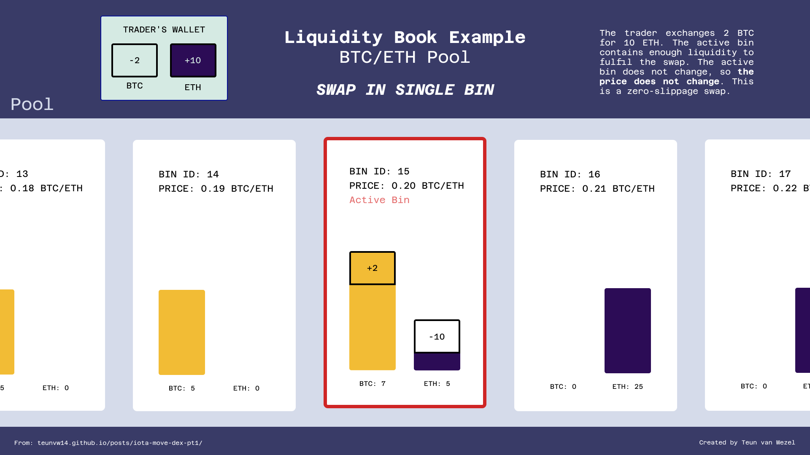
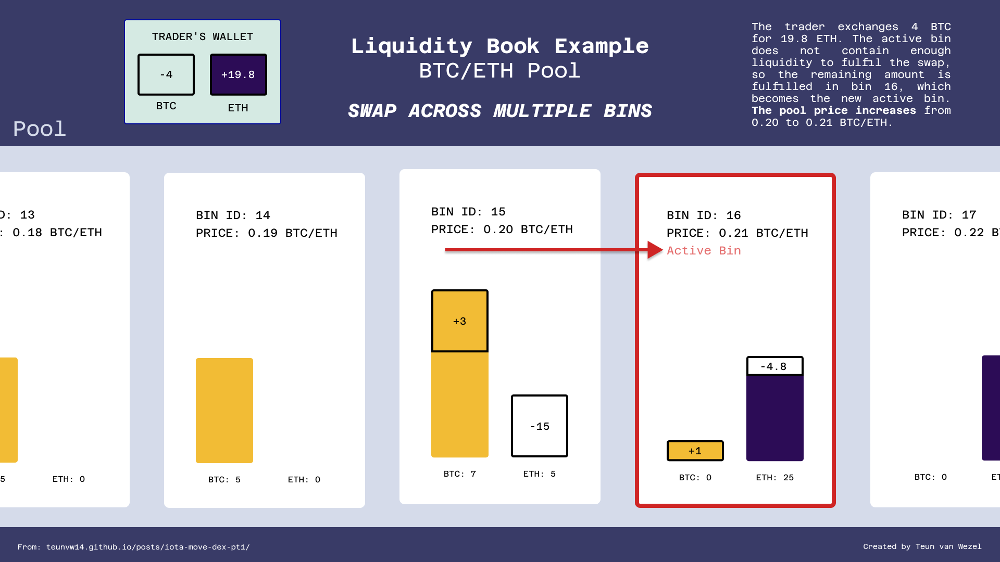
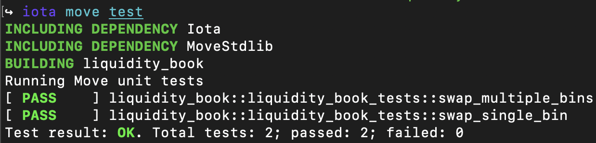

+++
title = "Move on IOTA Rebased: Building a Decentralized Exchange Smart Contract. Part 1: Liquidity Book Pools"
date = 2025-04-02
+++

# 1. Introduction

*Exchanges* are the cornerstone of any financial ecosystem, enabling capital to flow between different assets. In the world of crypto, centralized exchanges (CEXs) are the most familiar. You can buy and sell cryptocurrencies there, the centralized exchange matching up buyers and sellers in exchange for a fee.

Decentralized exchanges (DEXs) offer the same core functionality, but operate without any centralized third party. Instead, they are exchanges that run as smart contracts on top of a decentralized ledger, making them more censorship resistant, transparent and resilient than traditional centralized exchanges. In that sense, DEXs are quintessential decentralized finance: They let people sell and buy assets directly, at any time, with anyone, without any censorship or interference. The only rules for trading on a DEX, are the rules ones defined in the logic of their smart contracts.

If you've ever wondered what exactly that logic is, and how it is implemented, you're in luck. This article is the first in a three-part series on building a decentralized exchange with Move on the IOTA Rebased network. We'll develop a feature-rich Move smart contract based on the **Liquidity Book** (LB) model, originally designed by [LFJ](https://lfj.gg/). By the end of this series, you will have built your very own decentralized exchange and walk away with a deep understanding of how DEXs work. 

## 1.1 Article Series 

Though there are many beginner tutorials for Move, intermediate tutorials can be harder to find. Having familiarized themselves with the basics, developers often wonder: How do I actually build something with this? The scarcity of intermediate tutorials is unfortunate, because they can really help bridge the gap between basic understanding and practical application. This article series is an attempt to fill that gap. It tries to do this by walking through an example of building a relatively complex Move application: a decentralized exchange. The building of this smart contract is split up into three parts:

1. The first part (this one) walks through the first steps of writing a Move smart contract implementing the LB DEX model.

2. The [second part](../iota-move-dex-pt2/) describes how the DEX smart contract can be expanded to include fees and Liquidity Providers. 

3. The [third part](../iota-move-dex-pt3/) dives into *testing* Move smart contracts, which is crucial in gaining confidence that your Move does what it's supposed to do. 

## 1.2 Prerequisites

This is an intermediate tutorial aimed at developers wanting to get a deeper understanding of Move. You are expected to have some working familiarity with the basics of the Move language (things like shared/owned objects, struct abilities, how to publish modules). If you have never programmed with Move before, try working through [this article](../iota-rebased-sc/) and [this article](../iota-move-raffle-tutorial/) first. These should give you enough understanding to follow along here.

If at any point you get stuck, you can always refer back to the reference implementation, which you can find under the [`pt-1` branch of the accompanying GitHub repository](https://github.com/teunvw14/move-liquidity-book/tree/pt-1).

## 1.3 Acknowledgements 

*Many thanks to [iotalabs](https://iotalabs.io/) for supporting this article series with a grant.*

# 2. How Decentralized Exchanges Work

Since we will be building a decentralized exchange, it is probably be useful to know how they work. This subsection will give a brief description of how DEXs generally work. If you are already familiar, feel free to skip to the next subsection (2.1). If you want to get straight into the code, feel free to skip directly to chapter (3) and refer back to this section as needed.

By a **decentralized exchange**, or **DEX** for short, we mean a collection of trading pools, where each pool lets users swap between a different token pair. So, when we say we want to know "how a DEX works", what we really want to know is how its trading pools work. So that's what we will describe here.

Let's take as an example a pool with the token pair `ETH/BTC`. Then this `ETH/BTC` trading pool generally works like this:

- **Liquidity Providers (LP)**: Some users make their `BTC` and `ETH` available to be swapped against. The tokens they provide are collected (pooled) in a *liquidity pool*. These users are not really interested in swapping between the tokens. They simply provide this liquidity to earn fees from swaps inside the pool. Users that provide trading liquidity in this way are referred to as *liquidity providers* (sometimes shortened to LP).
- **Trade at Any Time without Counterparty**: Traders can swap `BTC` for `ETH`, or `ETH` for `BTC` at any time at the current pool price. These swaps do not require anyone on the other side buying the token the user is offering, or offering the token the user wants to buy.
- **Swaps Adjust the Pool Price**: Swapping for `BTC` makes `BTC` more expensive (in terms of `ETH`), and swapping for `ETH` makes `ETH` more expensive (in terms of `BTC`). This makes sure that the market is efficient. Capitalizing on an arbitrage opportunity - i.e., buying cheap on the DEX and selling for a higher price elsewhere - immediately resolves the price difference, because buying drives the price up. How much the price of a pair changes due to a swap is referred to as the *price slippage*. 
- **Impermanent Loss**: When a Liquidity Provider withdraws their liquidity, they may not get back exactly what they provided. If someone provides `10 ETH` and `0.5 BTC`, and the `BTC` price surges (relative to `ETH`), then some - or in the most extreme scenario, all -  of the `0.5 BTC` will have been swapped for `ETH`. When the Liquidity Provider withdraws, they get back much less than the `0.5 BTC` that they provided. Instead they get back an `ETH` amount "equivalent" to the `BTC` they didn't get back (in addition to the `10 ETH` deposited). The USD value of the withdrawn `ETH` and `BTC` might be lower than the USD value of the deposited amounts. This loss can be prevented by waiting until the `ETH/BTC` price returns to the price level at which the liquidity was provided (hence why it's called *impermanent loss*).

There are quite a few different models for DEXs. Some are relatively simple, like the traditional constant-product model. We will be building our DEX on a different, more complex model: the Liquidity Book model.

## 2.1 Liquidity Book Model

The definition given in the previous subsection is still quite abstract; there are not a lot of details, because they are very much dependent on what DEX model you are talking about. In this article series, we will be implementing the *Liquidity Book* (LB) model, used among others by [LFJ](https://lfj.gg/) on Avalanche, and [MagicSea](https://magicsea.finance/home) on the IOTA EVM. This subsection contains a detailed description of how the LB model works. (Though an interesting topic, *why* this is a good design is outside the scope of this article.)

You may wonder why we would want to implement the LB model in particular. The biggest reason is that it has some interesting complexities and nuances that make it a good challenge to implement. But LB pools also have some desirable features, the most important of which are the more efficient use of liquidity (through **concentrated liquidity**), and **zero-slippage** swaps. We will explain these in a bit. 

After highlighting these features, we will focus on how swaps are executed in an LB pool. This should make it easier to follow along with the implementation of swaps later in this article.

But first a little bit of information about providing liquidity in Liquidity Book pools. In the traditional constant product DEX model, provided liquidity is "distributed" across all possible prices (i.e., from 0 to infinity). In contrast, in the Liquidity Book model (LB) liquidity providers choose a price range within which they want to provide liquidity. This liquidity is then divided into discrete price bins. Liquidity providers only earn fees from trades that occur at prices (in bins) where they provide liquidity. This use of **concentrated liquidity** leads to a much more efficient use of provided liquidity. This model works especially well for pairs of tokens where the price is relatively stable, like between two different stablecoins that represent the same fiat currency (for example, the trading pair `USDC/USDT`). 

So what exactly are these *bins* that LB pools are made up of? In an LB pool, each bin represents a discrete price point at which swaps can occur. Every LB pool has one **active bin**, inside which the pool always starts executing swaps. In that sense, the active bin price represents the pool price. The pool always tries to execute a swap inside as few bins as possible. In cases where the swap is small enough, it can be executed completely in the active bin, so that the swap causes no price change. This is called a **zero-slippage** swap, and it is one of the unique features of LB pools.

### 2.1.1 LB Pool Swaps Examples
Let's look at two examples of swaps in an imaginary `ETH/BTC` LB pool. Let's assume that the pool already has some liquidity in it, and the starting state of the pool is as shown in the image below. 



We can see five bins of this pool (but there may be more). Bin `15` is the **active bin**, and it has a trading price of `0.20 ETH/BTC`. That means that any swaps, if they are small enough, will be filled at that price. 

There are a few things to note here:

- Only the active bin holds both `BTC` and `ETH`. We don't allow liquidity providers to add `BTC` to the right of the active bin, or `ETH` to the left of the active bin. This is because depositing liquidity in that way is basically putting up your liquidity below market price. Swaps only ever add tokens in the active bin.
- The price difference between each bin is `0.01` for simplicity and legibility; in practice, the price change between bins is not constant, but given as a percentage.
- Similar to the previous point: For legibility, the bin IDs here are quite low. In practice, they are much higher to accommodate a large number of different price points.


#### 2.1.1.1 LB Pool Single Bin Swap Example

As mentioned above, one of the largest advantages of the LB model is that it allows zero-slippage swaps, that is, swaps that don't change the price. Let's see that:



This swap is quite simple. Because the active bin has enough `ETH`, the swap executes inside the active bin, giving `2 BTC / 0.2 = 10 ETH`. Only the balance of the active bin is changed; no other state changes occur. 

#### 2.1.1.2 LB Pool Multiple Bin Swap Example

Only when you perform a swap of large enough magnitude, the price of the pair changes. The image below shows an example (executed from the same starting state):



This swap is a bit more complicated, so let's go over it in a little more detail. 

First, the swap trades `3 BTC` for `15 ETH` in the active bin `15`. The `ETH` in bin `15` is then depleted, but the trader still has `1 BTC` they want to swap. The swap **crosses over** to bin `16`, which becomes the active bin. There the pool fulfills the rest of the order at the new active bin price of `0.21 ETH/BTC`, resulting in `1 BTC / 0.21 ≈ 4.8 ETH`, making for a total swap of `4 BTC` for `19.8 ETH`. 

If bin `16` didn't contain the `4.8 ETH` required to complete the swap, the swap would have kept crossing over to bins on the right until the swap was complete. Note that if there was a very large amount of bins to the right, each holding a very small amount of `ETH`, the swap would cross over so many times (moving the active bin further and further right) that the swap would create a massive price increase. Alternatively, if there had been no more bins after bin `15`, and thus no more `ETH` to swap against, the swap would have aborted. Without the required `ETH`, the swap can't be fully completed, so the swap aborts. 

And that's how LB pool swaps work! If you would like to dive deeper into the technical details of the Liquidity Book model, take a look at the [LFJ docs](https://docs.lfj.gg/).

# 3. Let's Get Move-ing: Writing the Smart Contract

Now that we have discussed all the theory about DEXs, the time has come to actually build the LB DEX model in Move.

## 3.1 Required Tools

To write, test, and deploy Move smart contracts, you will need:

- The [IOTA CLI](https://github.com/iotaledger/iota) - compiling from source takes quite a while, so consider installing one of [the pre-built binaries](https://docs.iota.org/developer/getting-started/install-iota#install-from-binaries).
- Strongly recommended: Using Visual Studio Code with the [IOTA Move extension](https://marketplace.visualstudio.com/items?itemName=iotaledger.iota-move).

Make sure you have these installed before continuing.

## 3.2 Setup 

To set up our project, create a new Move project `liquidity_book` using the IOTA CLI:

```bash
$ iota move new liquidity_book
$ cd liquidity_book
```

There is only one other thing you will need: In this project, we will use a custom number type `UFP256` (Unsigned Fixed Point, 256-bit) for representing fractional token exchange rates. Make sure to download [`ufp256.move`](https://github.com/teunvw14/move-fixed-point/blob/main/sources/ufp256.move) and place the file into the `sources` directory. (If you're interested, the motivation for using a custom number type is given in the Appendix at the end of this article.)

## 3.3 Defining the Liquidity Book Protocol: `Pool` and `PoolBin` Types

Open up the `liquidity_book` folder in your preferred code editor. In this section, we will define the  `Pool` and `PoolBin` types. A `Pool` object will represent one LB pool, and will maintain the state of that pool as a [shared object](https://docs.iota.org/developer/iota-101/objects/object-ownership/shared). The `Pool` type will hold a collection of `PoolBin` objects, representing all the distinct price bins. 

### 3.3.1 `PoolBin`

Let's start off with the fundamental building block of our LB model, the `PoolBin`. 

#### 3.3.1.1 `PoolBin` Struct Definition

Inside a bin, swaps can take place at a constant price. So, the `PoolBin` needs a `price` field, at which trades inside that bin occur, and there are the balances: `balance_left` containing `L` and `balance_right` containing `R`. These balances hold the liquidity that is provided, and they are what traders can swap against. Though we will not integrate swap fees yet in this article, these balances will also store generated fees directly. 

Let's write our first lines of code. Inside `sources/liquidity_book.move`, we first import some dependencies, and define some constants. Do not worry about these for now,  we will need them later. 

Then underneath we define the `PoolBin` type:

```rust
// liquidity_book.move
module liquidity_book::liquidity_book {
    use iota::balance::{Self, Balance};
    use liquidity_book::ufp256::{Self, UFP256};
    use iota::vec_map::{Self, VecMap};

    const MID_U64: u64 = 9223372036854775808; // 2^64 / 2
    const ONE_BPS: u64 = 10000;

    public struct PoolBin<phantom L, phantom R> has store {
        price: UFP256, // The trading price inside this bin
        balance_left: Balance<L>,
        balance_right: Balance<R>,
    }
}
```

You might be unfamiliar with the notation `<L, R>` in the `PoolBin` definition. Adding this notation makes `PoolBin` *generic* over the token types `L` and `R`. (In Move, each token is represented by a unique type `T`. The IOTA token is represented by the `iota::iota::IOTA` type, for example.) Without *generics*, we would have to re-publish our smart contract for every new token pair that we want to create a pool for. The beauty of generics is that we can implement our types and functions for all different possible token pairs `L` and `R` in one go.

The `phantom` keyword in `<phantom L, phantom R>` comes simply from the fact that the `Balance` type is defined as `Balance<phantom T>`. In essence, the `phantom` keyword indicates that there isn't actually any object of type `T` stored inside a `Balance<T>`; the phantom type parameter just lets the Move type system differentiate between two different token balances `Balance<A>` and `Balance<B>`.

If you don't fully understand generics yet, don't worry. For this project, it suffices to understand that by using the `<L, R>` notation, we are defining a type or function for an arbitrary token pair `L`, `R`. If you want to get a deeper understanding of generics, check out [The Move Book section on generics](https://move-book.com/move-basics/generics.html).

The other notable concept unique to Move in the code above is the use of the [`store` ability](https://docs.iota.org/developer/iota-101/move-overview/structs-and-abilities/store). This ability makes it possible to store the `PoolBin` type inside a `Pool`. Unlike the `Pool` type that we will define, we purposely don't give `PoolBin` the [`key` ability](https://docs.iota.org/developer/iota-101/move-overview/structs-and-abilities/key). That's because, unlike the `Pool` type, we never want it to exist as a stand-alone object. It will always exist as part of a `Pool`. 

#### 3.3.1.2 `PoolBin` Convenience Functions

To make our life a bit easier, we will create a few convenience functions for the `PoolBin` type. Underneath the `PoolBin` struct, let's add these functions:

```rust
module liquidity_book::liquidity_book {
    [...]

    public struct PoolBin<phantom L, phantom R> has store {...}

    /// Public accessor for `bin.price`.
    public fun price<L, R>(self: &PoolBin<L, R>): UFP256 {
        self.price
    }

    /// Returns the left balance of a bin.
    public fun balance_left<L, R>(self: &PoolBin<L, R>): u64 {
        self.balance_left.value()
    }

    /// Returns the right balance of a bin.
    public fun balance_right<L, R>(self: &PoolBin<L, R>): u64 {
        self.balance_right.value()
    }
}
```

### 3.3.2 `Pool`

Up next, we will define the `Pool` type and the logic for creating them. We will also see how the `PoolBin` type integrates into it.

#### 3.3.2.1  `Pool` Struct Definition

We define the `Pool<L, R>` struct, again generic over the token types `L` and `R`, as follows:

```rust
// liquidity_book.move
module liquidity_book::liquidity_book {
    use iota::balance::{Self, Balance};
    use liquidity_book::ufp256::{Self, UFP256};
    use iota::vec_map::{Self, VecMap};

    const MID_U64: u64 = 9223372036854775808; // 2^64 / 2
    const ONE_BPS: u64 = 10000;

    public struct PoolBin<phantom L, phantom R> has store {...}

    public struct Pool<phantom L, phantom R> has key {
        id: UID,
        bins: VecMap<u64, PoolBin<L, R>>, // bins are identified with a unique id
        active_bin_id: u64, // id of the active bin
        bin_step_bps: u64, // The step/delta between bins in basis points (0.0001)
    }
}
``` 

Let's go over the `Pool` fields. The first field is a unique object id `UID`, as is required by the [`key` ability](https://docs.iota.org/developer/iota-101/move-overview/structs-and-abilities/key). We will store the bins of a `Pool` inside a `VecMap`, so that we can store and identify bins by a `u64` id (there are other ways, but this is perhaps the simplest). Additionally, we need to save the `active_bin_id`, so we know in which bins swaps should start executing. Finally, `bin_step_bps` is a configuration parameter chosen by the pool creator that determines what the price difference is between adjacent bins. This is typically chosen in direct proportion to the expected price volatility of the traded pair. (So a low bin step for a low volatility pair, and a high bin step for a high volatility pair. Can you think of why?) 

#### 3.3.2.2  `Pool` Initialization

Now that we have defined the `Pool` type, let's define an initialization function `new` for `Pool`. The whole thing is quite long, so we will break it down into parts.

Inside the `liquidity_book` module, start out by defining a function `new`:    

```rust
// liquidity_book.move
entry fun new<L, R>(
    bin_step_bps: u64,
    starting_price_mantissa: u256,
    mut starting_liquidity_left: Coin<L>,
    mut starting_liquidity_right: Coin<R>,
    bin_count: u64,
    ctx: &mut TxContext
) {
    // An odd number of bins is required, so that, including the active
    // bin, there is liquidity added to an equal amount of bins to the left
    // and right of the active bin
    assert!(bin_count % 2 == 1, EEvenBincount);
}
```
Let's begin with the function signature. The `new` function takes five arguments (not counting the `TxContext`). Let's go over them. 

The first two arguments directly correspond to configuration parameters for the `Pool` type. The `bin_step_bps` is used directly; the `starting_price_mantissa` gives the starting price as a mantissa (which, for the `UFP` type, is the starting price multiplied by `10^18`).

The other three arguments have to do with starting liquidity. We require from the caller `L` and `R` `Coin`s as starting liquidity. The `bin_count` parameter lets the caller specify across how many bins in total they would like to distribute the liquidity, i.e., how concentrated they would like the tokens to be inside the pool. (For now, we will keep things relatively simple and only allow adding liquidity to pools as they are created. Obviously, to speak of a proper DEX, we would need to create functions for liquidity providers to add and remove liquidity from a pool at any time. We will add this functionality in the next article.)

To simplify some calculations later on, we require `bin_count` to be odd, which we enforce with the `assert`. `EEvenBincount` is a custom error, which we need to define. At the top of your module (underneath the `const` definitions), add the error like this:

```rust
module liquidity_book::liquidity_book {
    use [...];
    const [...];

    #[error]
    const EEvenBincount: vector<u8> =
        b"Illegal bin count. Bin count is even but should be odd.";

    [...]
}
```

Next, let's go further into the function body. The biggest part of the `new` function will be to distribute the `starting_liquidity_left` and `starting_liquidity_right` across the `bin_count` bins. We start out by initializing some variables and then begin creating the left bins:

```rust
// liquidity_book.move
entry fun new<L, R>(...) {
    [...]
    // Start the first bin with ID in the middle of the u64 range, so as the
    // number of bins increase, the ID's don't over- or underflow
    let starting_active_bin_id = MID_U64;
    let starting_price = ufp256::new(starting_price_mantissa);
    let mut bins = vec_map::empty();

    // the amount of bins left and right of the active bin
    let bins_each_side = (bin_count - 1) / 2; 
    let coin_left_per_bin = starting_liquidity_left.value() / (bins_each_side + 1);
    
    // (10000 + bin_step_bps)/10000 =  1 + 0.0001 * bin_step_bps
    let bin_step_price_factor = ufp256::from_fraction(
        (ONE_BPS + bin_step_bps) as u256, 
        ONE_BPS as u256
    );
    let mut new_bin_price = starting_price.div(bin_step_price_factor);
    1u64.range_do_eq!(bins_each_side, |n| {
        // Initialize new bin
        let new_bin_id = starting_active_bin_id - n;
        let balance_for_bin = starting_liquidity_left.split(coin_left_per_bin, ctx).into_balance();

        let new_bin = PoolBin {
            price: new_bin_price,
            balance_left: balance_for_bin,
            balance_right: balance::zero(),
        };

        // Add bin
        bins.insert(new_bin_id, new_bin);
        new_bin_price = new_bin_price.div(bin_step_price_factor);
    });
}
```

In summary, the code takes these steps:

- Calculate `bins_each_side`: how many bins will be on the left and right of the starting active bin? Note that `bin_count` is the total number of bins, so it includes the starting active bin. Hence the `-1`.
- Calculate `coin_left_per_bin`: how much `L` should be in each bin? The `L` will be distributed among the starting active bin, and the bins to the left of it.
- Create `bins_each_side` instances of `PoolBin`, reducing the `new_bin_id` by one on each step, splitting off `coin_left_per_bin` for each one. The price for every next bin is reduced by a factor of `bin_step_price_factor`. 

Here the snippet `1.u64.range_do_eq!(N, |n| {f(n)} )` is a Move macro equivalent to `for n in range(N): f(n)` from Python, and similar expressions many other programming languages. 

As you may have guessed, we will do almost exactly the same for the bins to the right of the starting active bin:

```rust
// liquidity_book.move
entry fun new<L, R>(...) {
    [...]

    // Add right bins, very similar to above
    let coin_right_per_bin = starting_liquidity_right.value() / (bins_each_side + 1);
    let mut new_bin_price = starting_price.mul(bin_step_price_factor);
    1u64.range_do_eq!(bins_each_side, |n| {
        // Initialize new bin
        let new_bin_id = starting_active_bin_id + n;
        let balance_for_bin = starting_liquidity_right.split(coin_right_per_bin, ctx).into_balance();

        let new_bin = PoolBin {
            price: new_bin_price,
            balance_left: balance::zero(),
            balance_right: balance_for_bin,
        };

        // Add bin
        bins.insert(new_bin_id, new_bin);
        new_bin_price = new_bin_price.mul(bin_step_price_factor);
    });
}
```

The only major difference here is that on each step, instead of dividing, we multiply by `bin_step_price_factor`, since the price needs to increase instead of decrease.

Then the final step in creating the pool is adding the `starting_active_bin`. We use the remaining amounts in the `starting_liquidity_left` and `starting_liquidity_right` coins by directly converting them into balances. (Due to rounding errors, if we split off `coin_left_per_bin` and `coin_right_per_bin` from the `starting_liquidity` coins as we did for the other bins, some tokens may remain in those coins. We would then need to decide what we wanted to do with the coins, since they don't have the `drop` ability). 

```rust
// liquidity_book.move
entry fun new<L, R>(...) {
    [...]

    // Add starting bin
    let starting_active_bin = PoolBin {
        price: starting_price,
        balance_left: starting_liquidity_left.into_balance(),
        balance_right: starting_liquidity_right.into_balance()
    };
    bins.insert(starting_active_bin_id, starting_active_bin);

    // Create and share the pool
    let pool = Pool<L, R> {
        id: object::new(ctx),
        bins,
        active_bin_id: starting_active_bin_id,
        bin_step_bps,
    };

    transfer::share_object(pool);
}
```

The function ends by creating a `Pool` instance and calling `transfer::share_object` on it. This publishes the `pool` to the network as a shared object, where anyone can interact with it. In practice, this means that anyone will be able to mutate the state of `pool` using the functions defined in our `liquidity_book` module. 

Combining everything gives the full `new` function:

```rust
// liquidity_book.move
entry fun new<L, R>(
    bin_step_bps: u64,
    starting_price_mantissa: u256,
    mut starting_liquidity_left: Coin<L>,
    mut starting_liquidity_right: Coin<R>,
    bin_count: u64,
    ctx: &mut TxContext
) {
    // Start the first bin with ID in the middle of the u64 range, so as the
    // number of bins increase, the ID's don't over- or underflow
    let starting_active_bin_id = MID_U64;
    let starting_price = ufp256::new(starting_price_mantissa);
    let mut bins = vec_map::empty();

    // the amount of bins left and right of the active bin
    let bins_each_side = (bin_count - 1) / 2; 
    let coin_left_per_bin = starting_liquidity_left.value() / (bins_each_side + 1);
    
    let bin_step_price_factor = ufp256::from_fraction(
        (ONE_BPS + bin_step_bps) as u256, 
        ONE_BPS as u256
    );
    let mut new_bin_price = starting_price.div(bin_step_price_factor);
    1u64.range_do_eq!(bins_each_side, |n| {
        // Initialize new bin
        let new_bin_id = starting_active_bin_id - n;
        let balance_for_bin = starting_liquidity_left.split(coin_left_per_bin, ctx).into_balance();

        let new_bin = PoolBin {
            price: new_bin_price,
            balance_left: balance_for_bin,
            balance_right: balance::zero(),
        };

        // Add bin
        bins.insert(new_bin_id, new_bin);
        new_bin_price = new_bin_price.div(bin_step_price_factor);
    });

    // Add right bins, very similar to above
    let coin_right_per_bin = starting_liquidity_right.value() / (bins_each_side + 1);
    let mut new_bin_price = starting_price.mul(bin_step_price_factor);
    1u64.range_do_eq!(bins_each_side, |n| {
        // Initialize new bin
        let new_bin_id = starting_active_bin_id + n;
        let balance_for_bin = starting_liquidity_right.split(coin_right_per_bin, ctx).into_balance();

        let new_bin = PoolBin {
            price: new_bin_price,
            balance_left: balance::zero(),
            balance_right: balance_for_bin,
        };

        // Add bin
        bins.insert(new_bin_id, new_bin);
        new_bin_price = new_bin_price.mul(bin_step_price_factor);
    });

    // Add starting bin
    let starting_bin = PoolBin {
        price: starting_price,
        balance_left: starting_liquidity_left.into_balance(),
        balance_right: starting_liquidity_right.into_balance()
    };
    bins.insert(starting_active_bin_id, starting_bin);

    // Create and share the pool
    let pool = Pool<L, R> {
        id: object::new(ctx),
        bins,
        active_bin_id: starting_active_bin_id,
        bin_step_bps,
    };

    transfer::share_object(pool);
}
```

## 3.4 The Heart of a DEX: Swaps

Now that we have defined the types, and we can create a `Pool` with liquidity in it, we're ready to dive into the heart of the DEX: Swaps. For the sake of brevity, we will restrict ourselves to swaps from `L` to `R`, since swaps the other way, from `R` to `L` will be almost identical. 

### 3.4.1 Some More Convenience Functions (for `Pool`)

Actually, one last small thing before we dive into swaps. To help us write the code for executing swaps, there are a few functions on the `Pool` type that we can define to make things a bit simpler. We will not necessarily use all of them in this article, but not to worry: they will all be used by the end of this series. These do what they say on the tin; hopefully these are understandable without any further explanation.

Let's define the convenience functions underneath the `Pool` struct:
```rust
// liquidity_book.move
module liquidity_book::liquidity_book {
    [...]

    public struct Pool<phantom L, phantom R> has key {...}

    /// Returns a reference to a bin from a bin `id`.
    public fun get_bin<L, R>(self: &Pool<L, R>, id: &u64): &PoolBin<L, R> {
        let bin = self.bins.get(id);
        bin
    }

    /// Public accessor for `pool.active_bin_id`.
    public fun get_active_bin_id<L, R>(self: &Pool<L, R>): u64 {
        self.active_bin_id
    }

    /// Returns the pool's active bin price.
    public fun get_active_price<L, R>(self: &Pool<L, R>): UFP256 {
        self.get_active_bin().price
    }

    /// Returns a reference to the pool `active_bin`.
    public fun get_active_bin<L, R>(self: &Pool<L, R>): &PoolBin<L, R> {
        self.get_bin(&self.active_bin_id)
    }

    /// Private mutable accessor for the pool `active_bin`.
    fun get_active_bin_mut<L, R>(self: &mut Pool<L, R>): &mut PoolBin<L, R> {
        self.bins.get_mut(&self.active_bin_id)
    }

    /// Setter for `pool.active_bin_id`.
    fun set_active_bin<L, R>(self: &mut Pool<L, R>, id: u64) {
        if (self.bins.contains(&id)) {
            self.active_bin_id = id;
        }
    }
}
```


### 3.4.2 Implementing Swaps

Here is a quick recap of how swaps are executed in an LB DEX:

- While there is still some "input token" `L` remaining:
  - Try to execute the swap at the active bin price. 
  - If there is not enough liquidity to fulfill the swap inside the active bin, empty the active bin, and cross over to the next bin (i.e. change the active bin to the adjacent one). 
  - If the swap is not yet completed, and there are no more adjacent bins (meaning there is not enough liquidity inside the pool), the swap is aborted.

Translated into Move code, that results in: 
```rust
// liquidity_book.move
// Swap `coin_left` for an equivalent amount of `R` in `Pool`
public fun swap_ltr<L, R>(self: &mut Pool<L, R>, mut coin_left: Coin<L>, ctx: &mut TxContext): Coin<R> {
    let mut result_coin = coin::zero<R>(ctx);

    // Keep emptying bins until `coin_left` is fully swapped
    while (coin_left.value() > 0) {
        let active_bin = self.get_active_bin_mut();

        let mut swap_left = coin_left.value();
        let mut swap_right = active_bin.price.mul_u64(swap_left);

        // If there is not enough balance in this bin to fulfill
        // swap, adjust swap amounts to maximum.
        let bin_balance_right = active_bin.balance_right();
        if (swap_right > bin_balance_right) {
            swap_right = bin_balance_right;
            swap_left = active_bin.price.div_u64(bin_balance_right);
        };

        // Execute swap
        active_bin.balance_left.join(coin_left.split(swap_left, ctx).into_balance());
        result_coin.join(active_bin.balance_right.split(swap_right).into_coin(ctx));

        // Cross over one bin right if active bin is empty after swap,
        // abort if swap is not complete and no bins are left
        if (active_bin.balance_right() == 0) {
            let bin_right_id = self.active_bin_id + 1;
            if (coin_left.value() > 0) {
                assert!(self.bins.contains(&bin_right_id), EInsufficientPoolLiquidity);
            };
            self.set_active_bin(bin_right_id);
        };
    };
    coin_left.destroy_zero();

    result_coin
}
```

Only really one thing to note here: The `coin_left.destroy_zero()` is necessary because the `Coin` type does not have the [`drop` ability](https://docs.iota.org/developer/iota-101/move-overview/structs-and-abilities/drop). It's nearly impossible for the Move compiler to deduce from a piece of code whether a `Coin` still holds a value by the end of it. For that reason, we have to explicitly state that we are sure that `coin_left` no longer contains any value, and that it really can be destroyed safely.

We also added a new error here for when the pool has run out of liquidity, but the swap is not yet complete. Don't forget to define `EInsufficientPoolLiquidity` next to `EEvenBinCount` at the top of your module like this:

```rust
module liquidity_book::liquidity_book {

    use [...];
    const [...];

    #[error]
    const EEvenBincount: vector<u8> =
        b"Illegal bin count. Bin count is even but should be odd.";

    #[error]
    const EInsufficientPoolLiquidity: vector<u8> =
        b"Insufficient Pool Liquidity: There is not enough liquidity inside the pool to fulfill the trade.";

    [...]
}
```

The code for swapping left-to-right, `swap_rtl` is pretty much identical, but with any `left`/`right` variables swapped, and most crucially the multiplication (`R = pL`) needs to be replaced by division (`L = R/p`). It's good practice to try and code it yourself, but if you get stuck, you can always take a look at the [`swap_rtl` reference implementation](https://github.com/teunvw14/move-liquidity-book/blob/b18f9eedd82acf1a6da3f0a7ecccfd171aa69746/sources/liquidity_book.move#L207-L243).

And that's it! We can now create an LB pool and execute swaps.

# 4. Does it Work? Basic Testing

Having gone through the effort of writing all that code, you would probably like to see that it actually works. So, let's write a test to show exactly that.

Because the code we wrote has some complexity, creating a test for our `Pool` requires some non-trivial setup. The final part in this article series will dive much more deeply into testing, so we will not go into a lot of detail here. Nonetheless, hopefully the tests below are enough for you to convince yourself that the code we wrote works as intended. 

## 4.1 Single Bin Test

We'll start out by writing a relatively simple test that shows a trade within a single bin is successful. Open up `liquidity_book_tests.move`. We will need a few imports, structs and constants:
```rust
// liquidity_book_tests.move
#[test_only]
module liquidity_book::liquidity_book_tests {
    use iota::test_scenario as ts;
    use iota::test_utils::assert_eq;
    use iota::coin::{Self};

    use liquidity_book::liquidity_book::{Self, Pool};
    use liquidity_book::ufp256::{Self};

    public struct LEFT has drop {}
    public struct RIGHT has drop {}

    const DEFAULT_BIN_STEP: u64 = 20; // 20 BPS, or 0.2%
    const DEFAULT_PRICE_MANTISSA: u256 = 5000000000000000000; // 0.5
    const ONE_BPS: u64 = 10000;
}
```
We import some libraries needed for testing, the `liquidity_book` and `ufp256` modules. We also need the `coin` module to mint test tokens. 

Also, remember the `phantom` types mentioned in the beginning of this article? The `LEFT` and `RIGHT` structs that we define here will be used exactly in that way. We only define these so that we can create two "testing tokens" `Coin<LEFT>` and `Coin<RIGHT>`.

The constants are some default values that we use to define the testing LB pools. 

Now let's start writing a test `swap_single_bin`. We begin by creating a `Pool`:

```rust
// liquidity_book_tests.move
module liquidity_book::liquidity_book_tests {
    [...]

    #[test]
    fun swap_single_bin() {
        // Test starting boilerplate
        let admin_addr = @0xAAAA;
        let mut ts = ts::begin(admin_addr);

        // Initialize pool with 10bln LEFT and 10bln RIGHT tokens, all inside 1 bin
        let bln_10 = 10 * 10u64.pow(9);
        liquidity_book::new<LEFT, RIGHT>(
            DEFAULT_BIN_STEP,
            DEFAULT_PRICE_MANTISSA,
            coin::mint_for_testing<LEFT>(bln_10, ts.ctx()),
            coin::mint_for_testing<RIGHT>(bln_10, ts.ctx()),
            1,
            ts.ctx()
        );
    }
}
```

Here, we use `coin::mint_for_testing<T>`to get the test tokens that we need. We set the number of bins to 1, so that we can be sure that a swap executes only inside that one bin.

Next, we get the `Pool` that we created from global storage (using `take_shared`), and perform the swaps with small enough amounts so that `pool` doesn't run out of liquidity. We then check that the returned amounts match the expected amounts. 

```rust
// liquidity_book_tests.move
#[test]
fun swap_single_bin() {
    [...]

    // Set trader address for next transactions
    let trader_addr = @0xBBBB;
    ts.next_tx(trader_addr);

    // Perform swaps, 1bln of both
    let trade_left = 1 * 10u64.pow(9);
    let trade_right = 1 * 10u64.pow(9);

    let mut pool = ts.take_shared<Pool<LEFT, RIGHT>>();

    let coin_left_in = coin::mint_for_testing<LEFT>(trade_left, ts.ctx());
    let coin_right_in = coin::mint_for_testing<RIGHT>(trade_right, ts.ctx());

    let coin_right_result = pool.swap_ltr(coin_left_in, ts.ctx());
    let coin_left_result = pool.swap_rtl(coin_right_in, ts.ctx());

    // Check swap results
    let price = ufp256::new(DEFAULT_PRICE_MANTISSA);

    let expected_value_right = price.mul_u64(trade_left);
    assert_eq(coin_right_result.value(), expected_value_right);

    let expected_value_left = price.div_u64(trade_right);
    assert_eq(coin_left_result.value(), expected_value_left);
}
```

Finally, we have to "return" the `coin_right_result` and `coin_left_result` to the trader, and return the shared `pool` object to global storage. (These are needed to make the Move compiler happy. You can remove these lines to see what that means.) Then we can end the test with `ts.end()`.

```rust
// liquidity_book_tests.move
#[test]
fun swap_single_bin() {
    [...]

    // Return coins to owner to satisfy their lack of drop ability
    transfer::public_transfer(coin_right_result, trader_addr);
    transfer::public_transfer(coin_left_result, trader_addr);

    // Test end boilerplate
    ts::return_shared(pool);
    ts.end();
}
```
Combining the parts above gives the full `swap_single_bin` test:

```rust
// liquidity_book_tests.move
#[test]
fun swap_single_bin() {
    // Test starting boilerplate
    let admin_addr = @0xAAAA;
    let mut ts = ts::begin(admin_addr);

    // Initialize pool with 10bln LEFT and 10bln RIGHT tokens, all inside 1 bin
    let bln_10 = 10 * 10u64.pow(9);
    liquidity_book::new<LEFT, RIGHT>(
        DEFAULT_BIN_STEP,
        DEFAULT_PRICE_MANTISSA,
        coin::mint_for_testing<LEFT>(bln_10, ts.ctx()),
        coin::mint_for_testing<RIGHT>(bln_10, ts.ctx()),
        1,
        ts.ctx()
    );

    // Set trader address for next transactions
    let trader_addr = @0xBBBB;
    ts.next_tx(trader_addr);

    // Perform swaps, 1bln of both
    let trade_left = 1 * 10u64.pow(9);
    let trade_right = 1 * 10u64.pow(9);

    let mut pool = ts.take_shared<Pool<LEFT, RIGHT>>();

    let coin_left_in = coin::mint_for_testing<LEFT>(trade_left, ts.ctx());
    let coin_right_in = coin::mint_for_testing<RIGHT>(trade_right, ts.ctx());

    let coin_right_result = pool.swap_ltr(coin_left_in, ts.ctx());
    let coin_left_result = pool.swap_rtl(coin_right_in, ts.ctx());

    // Check swap results
    let price = ufp256::new(DEFAULT_PRICE_MANTISSA);

    let expected_value_right = price.mul_u64(trade_left);
    assert_eq(coin_right_result.value(), expected_value_right);

    let expected_value_left = price.div_u64(trade_right);
    assert_eq(coin_left_result.value(), expected_value_left);

    // Return coins to owner to satisfy their lack of drop ability
    transfer::public_transfer(coin_right_result, trader_addr);
    transfer::public_transfer(coin_left_result, trader_addr);

    // Test end boilerplate
    ts::return_shared(pool);
    ts.end();
}
```

## 4.2 Multiple Bin Test

The previous test shows that swaps inside a single bin work. Since the LB DEX model is fundamentally based on swaps changing the price by crossing over bins, you probably want to test that swaps across multiple bins work well too. If you want to add a test for that, you can of course write one yourself, but there is also an example `swap_multiple_bins` test included as an appendix at the end of this article, which you can copy. 

## 4.3 Running the Tests

To run your tests (including any other ones you may write), use the IOTA CLI. Inside the `liquidity_book` folder, run:

```bash
$ iota move test
```

If everything went well, all the tests should pass. The output will look like this:



# 5. Conclusion

That's all there is to it. We have successfully built our own DEX smart contract with Move! If you came all this way, thank you for reading.

If you want to learn more, in the next article in this series, we will discover how our smart contract can be expanded so that anyone can provide liquidity and start earning fees.

# 6. Challenges

- Implement price slippage limits in the swap functions `swap_ltr` and `swap_rtl`. Add a `max_slippage` parameter to the swap functions, and modify the functions to abort if the price change is larger than `max_slippage`.
- If you really want to challenge yourself, you can create a *router* function that can chain swaps between different pools. That is, a function generic over `L, R` that takes a list of `Pool`s, and if it does not contain a `Pool<L, R>`, it finds the shortest chain of pools `Pool<L, T_1>`, `Pool<T_1, T_2>`, ... `Pool<T_{n-1}, T_n>`, `Pool<T_n, R>` that can transform `L` into `R`, and executes swaps across that chain of pools. 


# Appendix A: About `UFP256` and Why Floating Point Numbers Are Bad

Why do we need a custom fractional number type? The honest answer is that we do not really. The IOTA Move framework provides [the `uq64_64` type](https://github.com/iotaledger/iota/blob/43412a93f4ef752104460ef630daea0631621f52/crates/iota-framework/packages/move-stdlib/sources/uq64_64.move). It would probably work for our purposes, but it has limited precision and some useful functions missing in its API. To fill the gap, I created the [`UFP256`](https://github.com/teunvw14/move-fixed-point/blob/main/sources/ufp256.move) type to use in this project. It  works identically to `uq64_64`, but has higher precision and an API that is a little bit more extensive. Whether the extra precision makes any difference is unknown. But the more extensive API is definitely nicer to work with.

You might be familiar with [floating-point numbers](https://en.wikipedia.org/wiki/Floating-point_arithmetic) and wonder why we don't just use those here. Especially since they are used in most programming languages to represent fractional values. It's not so much that they can't be implemented in smart contract programming languages. The reason you will most likely never see them in any smart contract programming contexts is that floating-point numbers require a lot more computation than fixed-point numbers, and in smart contracts, more computations means paying more gas. And no one wants to pay more gas. So floating-point numbers are a no-go.

# Appendix B: Multiple Bin Test

Below you can find the `swap_multiple_bins` test, as taken from [the reference implementation](https://github.com/teunvw14/move-liquidity-book/blob/19f51da5b11beab9d665a3f0e1dd426fe1edecda/tests/liquidity_book_tests.move#L74-L125). It is largely the same as the single bin test; the only difference is that we need to do some more complicated calculations to get `expected_value_right`, the expected amount of `RIGHT` from the trade. 

```rust
/// Test swaps by doing a swap crossing over one bin, checking that the received
/// amount is correct.
#[test]
fun swap_multiple_bins() {
    let admin_addr = @0xAAAA;
    let mut ts = ts::begin(admin_addr);


    // Initialize pool with 2bln LEFT and/or RIGHT per bin.
    let bin_count = 3;
    let left_amount_per_bin = 2 * 10u64.pow(9);
    let right_amount_per_bin = 2 * 10u64.pow(9);
    let left_amount = left_amount_per_bin * ((bin_count + 1) / 2);
    let right_amount = right_amount_per_bin * ((bin_count + 1) / 2);
    liquidity_book::new<LEFT, RIGHT>(
        DEFAULT_BIN_STEP,
        DEFAULT_PRICE_MANTISSA,
        coin::mint_for_testing<LEFT>(left_amount, ts.ctx()),
        coin::mint_for_testing<RIGHT>(right_amount, ts.ctx()),
        bin_count,
        ts.ctx()
    );


    // We will trade 6 LEFT for ~3 RIGHT
    let trade_amount_left = 6 * 10u64.pow(9);


    // Calculate expected swap results (left-to-right)
    let first_bin_price = ufp256::new(DEFAULT_PRICE_MANTISSA);
    let second_bin_price = first_bin_price.mul(ufp256::from_fraction((ONE_BPS+DEFAULT_BIN_STEP) as u256, ONE_BPS as u256));


    let right_from_first_bin = right_amount_per_bin;
    let left_traded_in_first_bin = first_bin_price.div_u64(right_amount_per_bin);
    let left_remaining = trade_amount_left - left_traded_in_first_bin;
    let right_from_second_bin = second_bin_price.mul_u64(left_remaining);
    let expected_value_right = right_from_first_bin + right_from_second_bin;


    // Perform swaps
    let trader_addr = @0xABAB;
    ts.next_tx(trader_addr);
    let coin_left = coin::mint_for_testing<LEFT>(trade_amount_left, ts.ctx());


    let mut pool= ts.take_shared<Pool<LEFT, RIGHT>>();
    let coin_right = pool.swap_ltr(coin_left, ts.ctx());


    // Assert that we received the expected amount of RIGHT tokens
    assert_eq(coin_right.value(), expected_value_right);


    // Return coins to owner
    transfer::public_transfer(coin_right, trader_addr);


    ts::return_shared(pool);
    ts.end();
}
```
