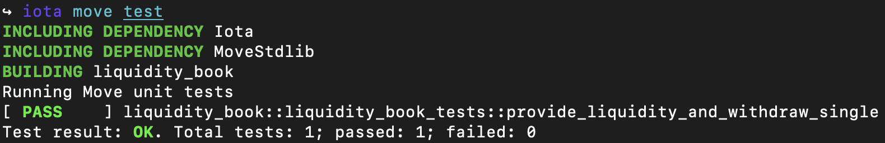

+++
title = "Move on IOTA Rebased: Building a Decentralized Exchange Smart Contract. Part 3: Testing"
date = 2025-12-31
+++

# Introduction

This article is the last article in a three-part series on creating a decentralized exchange with Move. Make sure you've read the previous articles before diving into this one:

- [*Part 1: Liquidity Book Pools*](../iota-move-dex-pt1/)
- [Part 2: Liquidity Providers and Fees](../iota-move-dex-pt2/)

For complex smart contracts (such as the DEX we have built), it can be hard to know for sure whether your code does exactly what you want it to do - that is, unless you set up a good suite of tests. In this article, we will discuss some of the more intermediate Move testing concepts to do exactly that.

Since our DEX requires some advanced tests, we will discuss testing basics very briefly, and move on to the more advanced concepts quickly. Though they are generally pretty intuitive (especially if you've written tests before, in any language), it may be useful to check out some basic tutorials first if you're not familiar. One excellent resource would be the [IOTA Move docs](https://docs.iota.org/developer/getting-started/build-test).

## Acknowledgements 

*Many thanks to [iotalabs](https://iotalabs.io/) for supporting this article series with a grant.*

# Why Elaborate Testing is Good

Building smart contracts is serious business. Unlike in traditional software, bugs in smart contracts are almost never "non-critical". That is, they usually have devastating effects: a bug can result in some or all users losing funds. Note that also unlike in traditional software, a bug cannot be patched. There's no way to "unpublish" a smart contract. If your smart contract has built up a user base, and someone finds a bug or exploit, you are in big trouble. Even if you're lucky, and no funds are lost, each user would have to manually unlock their funds from the buggy smart contract - with a massive dent in their trust of the smart contract developer as a result. And that is why it is crucial that you test your smart contracts.

Note that, if you really intend on building up a user base for your smart contract, you should have a third party audit your code to largely diminish the chance of your code containing serious bugs.

# Using `test_scenario`: Writing Our First Test

Let's get to writing a first test for our DEX. We will keep it simple to start: create a pool, provide liquidity to it, and then withdraw the liquidity. You should already have a `tests` folder in your project directory. Inside it, create `liquidity_book_tests.move`, and start by defining all the imports that we need. (Each import is annotated with a comment to explain why it is necessary.)

```rust
// tests/liquidity_book_tests.move
#[test_only]
module liquidity_book::liquidity_book_tests {
    // IOTA test imports
    use iota::test_scenario as ts;
    use iota::test_utils::assert_eq;
    // IOTA Framework imports
    use iota::coin::{Self, Coin};
    use iota::clock::{Self, Clock};

    // Our smart contract code
    use liquidity_book::liquidity_book::{
        Self,
        Pool,
        LiquidityProviderReceipt,
        get_fee
    };
    use liquidity_book::ufp256::{Self};

    // Structs for the two different `Coin` types in our Pool
    public struct LEFT has drop {}
    public struct RIGHT has drop {}

    // Default pool parameter values 
    const DEFAULT_FEE_BPS: u64 = 20;
    const DEFAULT_BIN_STEP: u64 = 20;
    const DEFAULT_PRICE_MANTISSA: u256 = 5000000000000000000; // 0.5
    // Basis point multiplier constant (i.e. one basis point)
    const ONE_BPS: u64 = 10000;
}
```

Now let's get started writing the liquidity provision test. You will see that as we write the test, there are quite a lot of steps involved in setting and handling the testing environment. For this first test, we will write out all the steps. It's important to see all the required steps once. However, after writing this first test, we will extract most of the boilerplate into reusable functions. 

Now, the first step in setting up the simple LP test is creating a new LB `Pool`. Define a function as shown below, using the `#[test]` annotation to let the Move compiler know that this code needs to be run as a test. (This also means that the code will not be part of the smart contract code when it's published). 

```rust
// tests/liquidity_book_tests.move
#[test]
fun provide_liquidity_and_withdraw_single() {
    let pool_creator = @0xABCDEF;
    let lp_addr = @0xA;
    let mut ts = ts::begin(pool_creator);
    {
        liquidity_book::new<LEFT, RIGHT>(
            DEFAULT_BIN_STEP,
            DEFAULT_PRICE_MANTISSA,
            DEFAULT_FEE_BPS,
            ts.ctx()
        );
    };
    // Next transaction so that the creation of the pool takes effect
    ts.next_tx(lp_addr);

    // Create Clock required for the call `provide_liquidity`
    let clock = clock::create_for_testing(ts.ctx());
}
```

What we see here is the starting of the test scenario (with `ts::begin`). The `test_scenario` (`ts`) module helps us write tests by executing our smart contract code in a sequence of transactions (as would happen when our smart contract is published onto the network). It's important to note that ledger changes - most important of which the transfer of objects - don't take effect until a transaction ends, and the only way to do that is by starting a new transaction. With each new transaction, we need to specify who is signing that transaction, which is why `ts::begin` takes an address, as will `ts::next_tx`, which we will call to start each new transaction (and end the current one). We don't need to use real addresses, `test_scenario` lets us use placeholders (like `@0xA`). 

Finally, note that the call to `liquidity_book::new` is surrounded by brackets `{}`. We will keep doing this for each new transaction; it's not strictly necessary, but it's good practice because it ensures that each transaction has its own separate scope. That way, you can be sure that two transactions don't accidentally interact somehow. 

Let's continue writing the test. We create a new transaction by calling `ts.next_tx` (using `lp_addr`, the liquidity provider's address), create `LEFT` and `RIGHT` `Coin`s, and then provide them as liquidity to the pool. We can use `ts.take_shared` to get the liquidity pool from the testing scenario's object ledger. 

```rust
fun provide_liquidity_and_withdraw_single() {
    ...

    let left_amount = 10 * 10u64.pow(9);
    let right_amount = 10 * 10u64.pow(9);
    let bin_count = 11; // Doesn't really matter here

    let mut pool = ts.take_shared<Pool<LEFT, RIGHT>>();

    // Provide liquidity and immediately withdraw
    ts.next_tx(lp_addr);
    {
        let coin_left = coin::mint_for_testing<LEFT>(left_amount, ts.ctx());
        let coin_right = coin::mint_for_testing<RIGHT>(right_amount, ts.ctx());
    
        pool.provide_liquidity_uniformly(
            bin_count,
            coin_left,
            coin_right,
            &clock,
            ts.ctx()
        );
    };
}
```

That's the most crucial part of the test done. To complete the test, we now need to use the `LiquidityProviderReceipt` that the `lp_addr` received to withdraw the liquidity. After withdrawal, we can check if the amounts are correct. To get the receipt, we will use another function from the `test_scenario` module: `take_from_address`. This function lets you take the most recently received object of a particular type from an address (in this case the liquidity provider's address). 

```rust 
fun provide_liquidity_and_withdraw_single() {
    ...

    ts.next_tx(lp_addr);
    {
        let receipt = ts.take_from_address<LiquidityProviderReceipt>(lp_addr);
        pool.withdraw_liquidity(receipt, ts.ctx());
    };

    ts.next_tx(lp_addr);
    {
        let withdrawn_coin_left = ts.take_from_address<Coin<LEFT>>(lp_addr);
        let withdrawn_coin_right = ts.take_from_address<Coin<RIGHT>>(lp_addr);
        assert_eq(withdrawn_coin_left.value(), left_amount);
        assert_eq(withdrawn_coin_right.value(), right_amount);
    };
}
```

Transaction effects don't become visible until the next transaction. That's why it's necessary to call `ts.next_tx(address)` every time we need to use some effect of the previous transaction. You can see that in this example: We cannot perform the liquidity provision and withdrawal in the same transaction, because we cannot access the `LiquidityProviderReceipt` until the liquidity provision transaction is completed.

To wrap up the test, we need to return the coins that we took from the liquidity provider's address, and return the `pool` shared object to the object ledger. Finally, we end the test scenario, and destroy the `Clock` object. (These last two steps are necessary because `Scenario` and `Clock` are both non-drop types, so without them, the test will not compile.)

```rust
fun provide_liquidity_and_withdraw_single() {
    ...

    ts.next_tx(lp_addr);
    {
        let withdrawn_coin_left = ts.take_from_address<Coin<LEFT>>(lp_addr);
        let withdrawn_coin_right = ts.take_from_address<Coin<RIGHT>>(lp_addr);
        assert_eq(withdrawn_coin_left.value(), left_amount);
        assert_eq(withdrawn_coin_right.value(), right_amount);
        // Return to address
        ts::return_to_address(lp_addr, withdrawn_coin_left);
        ts::return_to_address(lp_addr, withdrawn_coin_right);
    };

    ts::return_shared(pool);

    // Destroy non-drop objects
    ts.end();
    clock.destroy_for_testing();
}
```
And that's it! If everything went well, we should now be able to run this test and see that it passes:



# Some First Test Helper Functions

As mentioned above, writing just this one test involved a lot of boilerplate. We will see that there are a lot of common actions in the tests: We need to create a pool and provide liquidity to it. We will also need to withdraw liquidity and check the received amounts for multiple of the tests. It will make things a lot simpler if we write a few functions to execute these common actions, drastically reducing code duplication.

We'll go over quite a few helper functions here, but don't fret. These will for the most part be very simple. A large part of them come down to abstracting away the logic of accessing the `Pool`. This is possible because all tests will be conducted on exactly one `Pool` (with just one exception we will discuss at the end of this article).

To start off, let's create a function that sets up a `test_scenario` and creates a pool. In `tests/liquidity_book_tests.move`, add the following code:

```rust
// tests/liquidity_book_tests.move
#[test_only]
fun scenario_default_pool(): ts::Scenario {
    let placeholder_addr = @0xABCDEF;
    let mut ts = ts::begin(placeholder_addr);
    {
        liquidity_book::new<LEFT, RIGHT>(
            DEFAULT_BIN_STEP,
            DEFAULT_PRICE_MANTISSA,
            DEFAULT_FEE_BPS,
            ts.ctx()
        );
    };
    // Return the Scenario because we will need it to execute all further 
    // transactions
    ts 
}
```

Note that this function is annotated with `#[test_only]`. We will annotate all test helper functions this way to ensure that these functions only compile when running tests. Otherwise, testing code can unintentionally get mixed up into your non-testing code - where it doesn't belong (this can happen quite easily if you combine functional code and test code in one file). 

Let's also create a wrapper of this function which also adds liquidity to the created `Pool`:

```rust
#[test_only]
fun scenario_default_pool_with_liquidity(sender: address, bin_count: u64, left_amount: u64, right_amount: u64): (ts::Scenario, Clock) {
    let mut ts = scenario_default_pool();
    let clock = clock::create_for_testing(ts.ctx());
    ts.next_tx(sender);
    {
        provide_liquidity(&mut ts, sender, left_amount, right_amount, bin_count, &clock);
    };
    (ts, clock)
}
```

Something else we will have to do in basically every test is ending the scenario `ts` and destroying the `Clock`. Let's make a function: 

```rust
#[test_only]
fun end_scenario_with_clock(ts: ts::Scenario, clock: Clock) {
    ts.end();
    clock.destroy_for_testing();
}
```

Next, let's create a function for withdrawing an address's provided liquidity. In some cases we will have a `LiquidityProviderReceipt`, in some case we will not. To accommodate these two cases, we will create `withdraw_liquidity_with_receipt` which requires a receipt, and then create a wrapper `withdraw_liquidity` which wraps that function, getting the receipt from the sending address automatically. Here's the code:

```rust
#[test_only]
fun withdraw_liquidity_with_receipt(
    ts: &mut ts::Scenario,
    sender: address,
    receipt: LiquidityProviderReceipt
): (Coin<LEFT>, Coin<RIGHT>) {
    ts.next_tx(sender);
    {
        let mut pool = ts.take_shared<Pool<LEFT, RIGHT>>();

        let (coin_left, coin_right) = pool.withdraw_liquidity(receipt, ts.ctx());
        ts::return_shared(pool);
        (coin_left, coin_right)
    }
}

#[test_only]
fun withdraw_liquidity(
    ts: &mut ts::Scenario,
    sender: address
): (Coin<LEFT>, Coin<RIGHT>) {
    ts.next_tx(sender);
    {
        let receipt = ts.take_from_address<LiquidityProviderReceipt>(sender);

        withdraw_liquidity_with_receipt(ts, sender, receipt)
    }
}
```

Note that there's not really any other reason to withdraw liquidity than to test whether the liquidity provider receives the right amount. So, let's create a function that combines withdrawal (reusing the function we created above) with checking the coin values. 

```rust
#[test_only]
fun withdraw_and_check_coin_values(
    ts: &mut ts::Scenario,
    sender: address,
    expected_left_value: u64,
    expected_right_value: u64
) {
    ts.next_tx(sender);
    {
        let (coin_left, coin_right) = withdraw_liquidity(ts, sender);
        assert_eq(coin_left.value(), expected_left_value);
        assert_eq(coin_right.value(), expected_right_value);

        ts::return_to_address(sender, coin_left);
        ts::return_to_address(sender, coin_right);
    };
}
```

For providing liquidity, we will use the same method to handle the case where we want to have the receipt returned, and the case where we don't:
```rust
#[test_only]
fun provide_liquidity_receipt(
    ts: &mut ts::Scenario,
    sender: address,
    left_amount: u64,
    right_amount: u64,
    bin_count: u64,
    clock: &Clock
): LiquidityProviderReceipt {
    ts.next_tx(sender);
    {
        let coin_left = coin::mint_for_testing<LEFT>(left_amount, ts.ctx());
        let coin_right = coin::mint_for_testing<RIGHT>(right_amount, ts.ctx());

        let mut pool = ts.take_shared<Pool<LEFT, RIGHT>>();

        let receipt = pool.provide_liquidity_uniformly(
            bin_count,
            coin_left,
            coin_right,
            clock,
            ts.ctx()
        );

        ts::return_shared(pool);
        receipt
    }
}

// Function wrapping `provide_liquidity_receipt`
// Adds transfer of receipt to `sender`
#[test_only]
fun provide_liquidity(
    ts: &mut ts::Scenario,
    sender: address, 
    left_amount: u64,
    right_amount: u64,
    bin_count: u64,
    clock: &Clock
) {
    ts.next_tx(sender);
    {
        let receipt = provide_liquidity_receipt(
            ts,
            sender,
            left_amount, 
            right_amount,
            bin_count,
            clock
        );
        transfer::public_transfer(receipt, sender);
    }
}
```

We're almost done with the helper functions now. Let's add some functions to simplify executing a swap in the most recently created pool:

```rust
#[test_only]
fun swap_ltr(
    ts: &mut ts::Scenario,
    sender: address,
    coin_amount: u64,
    clock: &Clock
): Coin<RIGHT> {
    ts.next_tx(sender);
    {
        let coin_left = coin::mint_for_testing<LEFT>(coin_amount, ts.ctx());

        let mut pool = ts.take_shared<Pool<LEFT, RIGHT>>();
        let coin_right = pool.swap_ltr(coin_left, clock, ts.ctx());

        ts::return_shared(pool);
        coin_right
    }
}
```

In a few tests, we will not be interested in the output of a swap. To avoid having to deal with the returned coin, we create a wrapper for `swap_ltr` that sends the coin result to the transaction sender:

```rust
#[test_only]
fun swap_ltr_and_transfer(
    ts: &mut ts::Scenario,
    sender: address,
    coin_amount: u64,
    clock: &Clock
) {
    let coin_right = swap_ltr(ts, sender, coin_amount, clock);
    transfer::public_transfer(coin_right, sender);
}
```
Now finally, we create the same functions for `swap_rtl`, simply replacing `pool.swap_ltr` with `pool.swap_rtl`:

```rust
#[test_only]
fun swap_rtl(
    ts: &mut ts::Scenario,
    sender: address,
    coin_amount: u64,
    clock: &Clock
): Coin<LEFT> {
    ts.next_tx(sender);
    {
        let coin_right = coin::mint_for_testing<RIGHT>(coin_amount, ts.ctx());
        
        let mut pool = ts.take_shared<Pool<LEFT, RIGHT>>();
        let coin_left = pool.swap_rtl(coin_right, clock, ts.ctx());

        ts::return_shared(pool);
        coin_left
    }
}

#[test_only]
fun swap_rtl_and_transfer(
    ts: &mut ts::Scenario,
    sender: address,
    coin_amount: u64, 
    clock: &Clock
) {
    let coin_left = swap_rtl(ts, sender, coin_amount, clock);
    transfer::public_transfer(coin_left, sender);
}
```

Alright, that's it for the helper functions. 

## Simplifying Our First Test

Before we move onto writing other tests, we should simplify our first test. With all our new helper functions, it reduces to:

```rust
#[test]
fun provide_liquidity_and_withdraw_single() {
    let mut ts = scenario_default_pool();
    let lp_addr = @0xA;

    let left_amount = 10 * 10u64.pow(9);
    let right_amount = 10 * 10u64.pow(9);
    let bin_count = 11; // Doesn't really matter here

    let clock = clock::create_for_testing(ts.ctx());

    // Provide liquidity and immediately withdraw
    provide_liquidity(
        &mut ts,
        lp_addr,
        left_amount,
        right_amount,
        bin_count, 
        &clock
    );
    withdraw_and_check_coin_values(&mut ts, lp_addr, left_amount, right_amount);

    end_scenario_with_clock(ts, clock);
}
```

That does save a *lot* of lines. As we write more tests, we'll see that abstracting away all that logic was all the more worth our effort. 

# Testing for The Liquidity Provider: Supplying, Withdrawing and Earning Fees

In this section, we will create tests from the perspective of the liquidity provider. We will look at a variety of different scenarios to make sure that providing and withdrawing, as well as earning fees, works as expected.

## No Fees: Multiple Liquidity Providers

Let's expand on our first test by writing a test with multiple liquidity providers. Start by defining a test and setting up the required context:

```rust
#[test]
fun provide_liquidity_and_withdraw_plural() {
    let mut ts = scenario_default_pool();
    let clock = clock::create_for_testing(ts.ctx());

    // Define parameters
    let bin_count = 11; // Doesn't really matter
    let lp_addrs = vector[@0xA, @0xB, @0xC, @0xD, @0xE];
    let left_amounts = vector[2, 4, 6, 8, 10];
    let right_amounts = vector[1, 3, 5, 7, 9];
}
```

Here, we first see the use of `vector`. These can be used to define lists of a single datatype. We define a `vector` of addresses of the liquidity providers and the provision amounts for each of those addresses. (It's not really important which amounts you let each LP provide. (The amounts shown here are basically random). 

The rest of the test is pretty straightforward: we make all of the LP's provide liquidity, and then make all of them withdraw.

```rust
fun provide_liquidity_and_withdraw_plural() {
    ...

    // First provide all liquidity
    lp_addrs.length().do!(|i| {
        provide_liquidity(
            &mut ts,
            lp_addrs[i],
            left_amounts[i],
            right_amounts[i],
            bin_count,
            &clock
        );
    });

    // Withdraw and verify amounts
    lp_addrs.length().do!(|i| {
        withdraw_and_check_coin_values(
            &mut ts,
            lp_addrs[i],
            left_amounts[i],
            right_amounts[i]
        );
    });

    end_scenario_with_clock(ts, clock);
}
```

Here we make use of the wonderful `do!(|i| {f(i)})` macro, which lets us do something for every entry of a vector. This macro increments a temporary indexing variable `i` from 0 to `lp_addrs.length()` (exclusive). We then use this indexing variable to provide and withdraw the right amounts of liquidity for each LP by accessing elements of vectors with `[i]`. (The `do!` macro is one of the Move vector macros with a similar functionality to `V.forEach(|i| {f(i)})` or `for v in V` you may be familiar with from other programming languages. To be exact, `N.do!(|i| {f(i)})` should be read as `for i in range(N)) {f(i)}`, or "for i between 0 and N exclusive, execute f(i)"). 

Make sure your new test works by calling `iota move test`, and checking that it passes. If it does, congratulations! (If it doesn't, I'm confident you can figure out why it doesn't, since you've already come this far.) Now let's talk earning fees.

## Testing Fees: Single Liquidity Provider

Our previous tests confirm that supplying and withdrawing liquidity works fine if no trades happen in the pool in the mean time. Obviously, this isn't a realistic scenario, given that the whole point of providing liquidity is to earn fees from swaps. Let's dive into testing fee-earning next.

Let's start by writing a test for the simplest possible scenario: there is one liquidity provider, a trader executing two "equivalent" swaps, all in just a single bin. Then we make sure the Liquidity Provider actually gets the expected amount of fees when they withdraws. We will start out by setting up a pool and providing liquidity to it:

```rust
#[test]
fun earn_fees_single_lp() {
    let mut ts = scenario_default_pool();
    let lp_addr = @0xA;
    let trader_addr = @0xB;

    let left_supplied = 300 * 10u64.pow(9);
    let right_supplied = 300 * 10u64.pow(9);
    let bin_count = 3; // Doesn't really matter here

    let clock = clock::create_for_testing(ts.ctx());

    provide_liquidity(&mut ts,
        lp_addr,
        left_supplied,
        right_supplied,
        bin_count,
        &clock
    );
}
```
The bin count doesn't really matter; all we need to do is make sure that the active bin has enough liquidity to execute the swap. This avoids a complex calculation for the fee.

Now let's execute some swaps. We will trade two amounts that should be exactly equivalent under the `Pool`s price. 
```rust
#[test]
fun earn_fees_single_lp() {
    ...
    let trade_left = 1 * 10u64.pow(9);
    let trade_right = ufp256::new(DEFAULT_PRICE_MANTISSA).mul_u64(trade_left);
    swap_ltr_and_transfer(&mut ts, trader_addr, trade_left, &clock);
    swap_rtl_and_transfer(&mut ts, trader_addr, trade_right, &clock);
}
```

Now, to finish the test, we withdraw the liquidity and check that the liquidity provider does indeed get their tokens, plus the fees from the two swaps.

```rust
fun earn_fees_single_lp() {
    ...
    let expected_earned_fee_left = get_fee(trade_left, DEFAULT_FEE_BPS);
    let expected_earned_fee_right = get_fee(trade_right, DEFAULT_FEE_BPS);

    withdraw_and_check_coin_values(
        &mut ts, 
        lp_addr, 
        left_supplied + expected_earned_fee_left,
        right_supplied + expected_earned_fee_right
    );
    end_scenario_with_clock(ts, clock);
}
```

And that's it! Again, make sure to check that your test passes with the `iota move test` command.

## Testing Fees: Multiple Liquidity Providers

Now, to make things a little more complex, let's add a test for earning fees when the `Pool` has multiple liquidity providers. It's largely similar to the previous test, we just need a little bit more code to handle the multiple liquidity providers. Let's start out by setting up the pool and supplying liquidity:

```rust
/// Test if fees are properly distributed when there are multiple liquidity
/// providers for a pool.
#[test]
fun earn_fees_multi_lp() {
    let mut ts = scenario_default_pool();
    let trader_addr = @0xB;
    let clock = clock::create_for_testing(ts.ctx());

    let lp_addrs = vector[@0xA, @0xB, @0xC, @0xD, @0xE];
    let left_supplied = 100 * 10u64.pow(9);
    let right_supplied = 100 * 10u64.pow(9);

    // First provide all liquidity
    let bin_count = 3; // Doesn't really matter here
    let mut i = 0;
    lp_addrs.do!(|lp_addr|{
        provide_liquidity(&mut ts, lp_addr, left_supplied, right_supplied, bin_count, &clock);
        i = i + 1;
    });
}
```

Again, we use a vector to hold multiple addresses and loop over them with the `lp_addrs.do!()` macro. To not complicate things, we make each LP provide the same amounts over the same amount of bins. To finish the test, we execute two swaps, just like in the previous test, and then we make sure that each LP gets the right amount of tokens upon withdrawing.

```rust
fun earn_fees_multi_lp() {
    ...

    // Perform swaps
    let trade_left = 1 * 10u64.pow(9);
    let trade_right = ufp256::new(DEFAULT_PRICE_MANTISSA).mul_u64(trade_left);

    // Expected earned fees per liquidity provider
    let expected_earned_fee_left = get_fee(trade_left, DEFAULT_FEE_BPS) / 5;
    let expected_earned_fee_right = get_fee(trade_right, DEFAULT_FEE_BPS) / 5;

    swap_ltr_and_transfer(&mut ts, trader_addr, trade_left, &clock);
    swap_rtl_and_transfer(&mut ts, trader_addr, trade_right, &clock);

    // Check that the expected amount of fees are earned
    // Then withdraw one by one
    let mut i = 0;
    lp_addrs.do!(|lp_addr|{
        withdraw_and_check_coin_values(&mut ts, lp_addr, left_supplied + expected_earned_fee_left, right_supplied + expected_earned_fee_right);
        i = i + 1;
    });

    end_scenario_with_clock(ts, clock);
}
```

# Testing for The Trader: Swaps

Let's begin writing some tests for swaps. Again, we will discuss a few different scenarios that we expect to see in the use of the `Pool`s. 

## Simple Swaps: Single Bin
The simplest scenario is the one where a single trader swaps inside a single bin. Let's start writing this test by setting up a pool, defining the trading amounts, and executing the swaps:

```rust
#[test]
fun swap_single_bin() {
    let (mut ts, clock) = scenario_default_pool_with_liquidity(
        @0xABCDEF,
        1,
        10 * 10u64.pow(9),
        10 * 10u64.pow(9)
    );

    // Perform swaps
    let trader_addr = @0xABAB;
    let trade_left = 1 * 10u64.pow(9);
    let trade_right = 1 * 10u64.pow(9);
    let coin_right = swap_ltr(&mut ts, trader_addr, trade_left, &clock);
    let coin_left = swap_rtl(&mut ts, trader_addr, trade_right, &clock);
}
```

Note that we don't have to mint any tokens here, since the `swap_ltr` / `swap_rtl` helper functions do that already. To finish off this test, we should check the received `Coin` amounts. We calculate the expected amounts by first deducting the fee amount directly from the input `Coin`s, and then multiplying and dividing by the `Pool`s price to get the right and left values respectively. Then we assert that the received coin values are equal to the expected values.

```rust
fun swap_single_bin() {
    ...
    // Check swap results
    let price = ufp256::new(DEFAULT_PRICE_MANTISSA);

    let trade_left_after_fees = trade_left * (ONE_BPS - DEFAULT_FEE_BPS) / ONE_BPS;
    let expected_value_right = price.mul_u64(trade_left_after_fees);
    assert_eq(coin_right.value(), expected_value_right);

    let trade_right_after_fees = trade_right * (ONE_BPS - DEFAULT_FEE_BPS) / ONE_BPS;
    let expected_value_left = price.div_u64(trade_right_after_fees);
    assert_eq(coin_left.value(), expected_value_left);

    // Return coins to owner
    transfer::public_transfer(coin_right, trader_addr);
    transfer::public_transfer(coin_left, trader_addr);

    end_scenario_with_clock(ts, clock);
}
```

To complete the test, we need to do something with the `Coin`s, since they are non-drop. So we simply "give back" the coins to the trader's address. Make sure to run your test and check that it passes. For the next test, let's make things a bit more challenging.

## Simple Swaps: Multiple Bins

The previous test was pretty straight forward, mostly because we didn't cross over any bins. In this subsection, we will write a test for the more complicated multi-bin scenario. The setup will be largely the same as for the previous test. We will just need to do some more complicated calculations for the expected amounts. The setup does now include specific amounts, so that we can guarantee that the swap will cross over one bin.

```rust
#[test]
fun swap_multiple_bins() {
    // Deposit 2bln LEFT and/or RIGHT per bin.
    let bin_count = 3;
    let left_amount_per_bin = 2 * 10u64.pow(9);
    let right_amount_per_bin = 2 * 10u64.pow(9);
    let left_amount = left_amount_per_bin * ((bin_count + 1) / 2);
    let right_amount = right_amount_per_bin * ((bin_count + 1) / 2);
    let (mut ts, clock) = scenario_default_pool_with_liquidity(
        @0xABCDEF,
        bin_count,
        left_amount,
        right_amount
    );

    // Perform swaps
    let trader_addr = @0xABAB;
    let trade_amount_left = 6 * 10u64.pow(9);
    let trade_amount_right = 3 * 10u64.pow(9);
}
```

We will first swap `L` for `R`, crossing over one bin to the right. Then we will execute a second swap, `R` for `L` which crosses back over the starting bin. The calculations can be a bit hard to follow, so comments are added to hopefully make things a bit more clear.

```rust
fun swap_multiple_bins() {
    ...

    // Calculate expected swap results (left-to-right)
    let first_bin_price = ufp256::new(DEFAULT_PRICE_MANTISSA);
    // The below calculation has to be executed in this way, because it mimics 
    // the implementation in the smart contract. (To be precise, it could cause
    // issues if you did the multiplication before the division.)
    let second_bin_price = first_bin_price.mul(ufp256::from_fraction((ONE_BPS+DEFAULT_BIN_STEP) as u256, ONE_BPS as u256));

    // We swap enough to cross over, so we will certainly receive all of the
    // `right` in the starting bin
    let right_from_first_bin = right_amount_per_bin;
    let left_traded_in_first_bin_no_fees = first_bin_price.div_u64(right_amount_per_bin);
    // Since the swap crosses a bin, fees are paid by addition instead of by 
    // deduction (that is, we pay more tokens, instead of getting less tokens in
    // return). This is a strictly technical distinction, but it's important
    // because it means we need to use `apply_fee_inv` to calculate the fees 
    // paid.
    let left_remaining = trade_amount_left - (apply_fee_inv(left_traded_in_first_bin_no_fees, DEFAULT_FEE_BPS));
    let right_from_second_bin = second_bin_price.mul_u64(apply_fee(left_remaining, DEFAULT_FEE_BPS));

    // Add up the amounts
    let expected_value_right = right_from_first_bin + right_from_second_bin;

    // Swap and check left-to-right swap
    let coin_right = swap_ltr(&mut ts, trader_addr, trade_amount_left, &clock);
    assert_eq(coin_right.value(), expected_value_right);

    // Calculate expected swap results (right-to-left)
    // Now we need to make sure to account for the `LEFT` tokens left in the 
    // bins by the left-to-right swap. The first two lines below mimic the lines
    // above to calculate `left_remaining`.
    let left_for_full_first_bin_no_fee = first_bin_price.div_u64(right_amount_per_bin);
    let left_from_second_bin = trade_amount_left - (apply_fee_inv(left_for_full_first_bin_no_fee, DEFAULT_FEE_BPS));
    // Now we calculate how much right we still have after the swap in the
    // right-most bin, and crossing over to the starting bin
    let right_remaining =  trade_amount_right - (apply_fee_inv(second_bin_price.mul_u64(left_from_second_bin), DEFAULT_FEE_BPS));
    let left_from_first_bin = first_bin_price.div_u64(apply_fee(right_remaining, DEFAULT_FEE_BPS));

    // Add up the amounts
    let expected_value_left = left_from_first_bin + left_from_second_bin;

    // Swap and check the right-to-left swap
    let coin_left = swap_rtl(&mut ts, trader_addr, trade_amount_right, &clock);
    assert_eq(coin_left.value(), expected_value_left);

    // Return coins to owner
    transfer::public_transfer(coin_right, trader_addr);
    transfer::public_transfer(coin_left, trader_addr);

    end_scenario_with_clock(ts, clock);
}
```

That's it! Quite a bit of finnicky calculations, but at least we can now be sure - if your test does pass, and it should - that the core of the Liquidity Book model works. 

## Lots of Swaps: More Swaps

Let's kick it up a notch and do a more vigorous test: we should write a test for executing a whole load of swaps. (This test passing doesn't really test anything that the other tests don't already test, but it is fun.) Let's do a hundred swaps. We will alternate left-to-right and right-to-left swaps to keep the amount in the starting bin balanced. The test is pretty concise: setup, do swaps, and wrap up.

```rust
#[test]
fun swap_single_bin_lots_of_swaps() {
    let (mut ts, clock) = scenario_default_pool_with_liquidity(
        @0xABCDEF,
        1,
        5 * 10u64.pow(9),
        5 * 10u64.pow(9)
    );

    // Set equivalent left and right amount so trades don't change active bin
    let trader_addr = @0xABAB;
    let trade_left = 1 * 10u64.pow(9);
    let trade_right = ufp256::new(DEFAULT_PRICE_MANTISSA).mul_u64(trade_left);

    // Perform 100 swaps
    let mut i = 0;
    while (i < 100) {
        swap_ltr_and_transfer(&mut ts, trader_addr, trade_left, &clock);
        swap_rtl_and_transfer(&mut ts, trader_addr, trade_right, &clock);
        i = i + 1;
    };

    end_scenario_with_clock(ts, clock);
}
```

Although we didn't have much reason to suspect problems, this test confirms that our `Pool` stays stable even if a large number of swaps occurs in one. You may be tempted to increase the number of swaps dramatically, as I was. Unfortunately, you will see that increasing the number of swaps even slightly results in your test giving a TIMEOUT. You then may be tempted to try and increase the timeout limit for tests, but as far as the documentation goes, no way to change it is specified. (This was presumably done to discourage Move developers from writing code which takes a lot of time (and thus gas) to execute.) 

That's it for all the swap tests! There is a lot of things we could still test with regards to swaps, but to not stretch this article out any longer, we leave it to the reader as an exercise. Let's move on to the final category of tests in this article, confirming that some things do *not* work.

# Testing Expected Failures

In addition to testing the successful execution of code, it's also important to test that errors are thrown whenever we expect them. To wrap up this article, we will look at some expected failures, and show that our code fails successfully.

## Expected Failure: Nonsensical Liquidity Provisions

Let's start with the `ENoLiquidityProvided` error whenever someone tries to call `provide_liquidity_uniformly` with coins of zero value. We wrote the following in our original implementation:

```rust
entry fun provide_liquidity_uniformly<L, R>(
    mut coin_left: Coin<L>,
    mut coin_right: Coin<R>,
    ...
) {
    // Assert some minimal amount of liquidity is added
    assert!(coin_left.value() > 0 || coin_right.value() > 0,
        ENoLiquidityProvided);

    [...]
}
```

Let's create a test to show that the error is actually thrown. By using the `#[expected_failure]` annotation, we can let the Move compiler know that failure is actually expected, and the test should pass if (and only if) the code generates a runtime error.
```rust
#[test]
#[expected_failure(abort_code = liquidity_book::ENoLiquidityProvided)]
fun provide_liquidity_uniformly_abort_on_no_liquidity() {
    let mut ts = scenario_default_pool();

    let bin_count = 1;
    let clock = clock::create_for_testing(ts.ctx());
    let placeholder_addr = @0xABCDEF;
    provide_liquidity(&mut ts, placeholder_addr, 0, 0, bin_count, &clock);

    end_scenario_with_clock(ts, clock);
}
```

You might wonder why we still need to call `end_scenario_with_clock`, given that this code will never be reached (if the test does indeed fail at runtime on `provide_liquidity` as expected). This is because the test still needs to be valid at compile-time, since the compiler doesn't know which part of the code you expect to fail. 

## Expected Failure: Receipt Fraud

Let's look at one other expected failure, `EInvalidPoolID`. This error is thrown when someone tries to use the receipt for the wrong pool. To test this error, we'll create two pools, and try to use a receipt we got from the second pool to withdraw from the first. Note that unfortunately we can't use the helper functions we wrote. This is because they all depend on only one `Pool` existing in the test scenario's object pool. Luckily, this means that most of the function should read to you as boilerplate:

```rust
#[test]
#[expected_failure(abort_code = liquidity_book::EInvalidPoolID)]
fun reject_invalid_receipt() {
    let lp_addr = @0xA;
    let left_supplied = 5 * 10u64.pow(9);
    let right_supplied = 5 * 10u64.pow(9);
    // Create first pool
    let (mut ts, clock) = scenario_default_pool_with_liquidity(
        @0xABCDEF,
        1,
        left_supplied,
        right_supplied
    );

    // Create second pool and have `lp_addr` provide the same liquidity as already
    // exists in the first pool
    liquidity_book::new<LEFT, RIGHT>(
        DEFAULT_BIN_STEP,
        DEFAULT_PRICE_MANTISSA,
        DEFAULT_FEE_BPS,
        ts.ctx()
    );
    let receipt = provide_liquidity_receipt(
        &mut ts,
        lp_addr, 
        left_supplied,
        right_supplied,
        1,
        &clock
    );

    // Get receipt to try to withdraw liquidity from the other pool
    ts.next_tx(lp_addr);

    // Call take_shared twice to get the first pool
    let second_pool = ts.take_shared<Pool<LEFT, RIGHT>>();
    let mut first_pool = ts.take_shared<Pool<LEFT, RIGHT>>();

    // Try to withdraw from the wrong pool (namely from the first pool)
    let (left_coin, right_coin) = first_pool.withdraw_liquidity(receipt, ts.ctx());
    transfer::public_transfer(left_coin, lp_addr);
    transfer::public_transfer(right_coin, lp_addr);

    ts::return_shared(second_pool);
    ts::return_shared(first_pool);
    end_scenario_with_clock(ts, clock);
}
```

Hopefully the code is self-explanatory, especially with the added comments. Note here that we changed the "expected failure abort code" to `liquidity_book::EInvalidPoolID` to make sure that the code results in this error. Note again how again, the line that we expect to throw the error (where we call `first_pool.withdraw_liquidity(...)`) isn't the last line. We still need to make sure the code makes sense even if it *didn't* throw an error. 

Ideally, your code would include a test for each possible error that your code throws. This is one of the challenges listed at the end of this article. 

And with that, we have come to the conclusion of this article on testing.

# Wrap up

Now, we have come to the end of this article, and with it, the end of this article series showing you exactly how to build a Liquidity Book DEX with Move. If you've come all this way, thank you very much for reading. I hope you learned something new, and are excited to keep building smart contracts with Move. Below, I've included a few more challenges for you to complete, if you're up for the challenge. 

Thanks again to *iotalabs* for supporting this article series with a grant, and thanks to you, the reader, for reading.

# Challenges
There are many different tests that one could write. Here are two suggestions:

- Create a test which combines swaps over multiple bins and multiple liquidity providers.
- Create `#[expected_failure]` tests for the two other errors that we included in our `liquidity_book.move` code: `EInsufficientPoolLiquidity`, and `EEvenBincount`.
