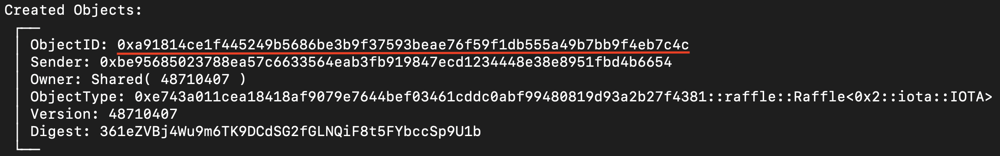
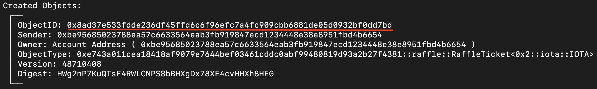
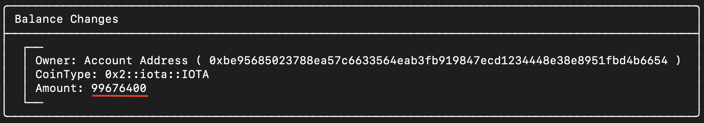

+++
title = "IOTA Rebased - Writing a Raffle Smart Contract With Move"
date = 2024-12-23
+++


In this article, we'll see how you can create a raffle smart contract with Move on [IOTA Rebased](https://blog.iota.org/iota-rebased-fast-forward). This smart contract will let users create raffles, and sell tickets for them. The goal of this article is to teach you about Move smart contracts by guiding you through writing one yourself. There are exercises at the end of this article to challenge you to expand the smart contract in your own way.

The source code for this project can be found [here on GitHub](https://github.com/teunvw14/move-raffle).

## Prerequisites
Though this is a tutorial for Move beginners, if you have never written or deployed a Move smart contract on IOTA Rebased, it's recommended to read and work through [this article](../iota-rebased-sc/) first. The reader is expected to have some programming knowledge. 

To write, test, and deploy our smart contract, we will need:

- [IOTA CLI](https://github.com/iotaledger/iota) - compiling from source takes quite a while, so consider installing one of [the pre-built binaries](https://docs.iota.org/developer/getting-started/install-iota#install-from-binaries)
- Strongly recommended: Using Visual Studio Code with the [IOTA Move extension](https://marketplace.visualstudio.com/items?itemName=iotaledger.iota-move)

## Raffle functionality description

Before we get started, we should specify what exactly we want our raffle smart contract to do. To start off:

- It should let users create new raffles. Users should be able to set a ticket price (in a token of their choice), and a resolution time after which the winner of the raffle can claim the prize money;
- It should let users buy tickets to any existing raffles;
- It should allow users to "resolve" the raffle after the resolution time, and claim the prize money if they won. 

You might be able to come up with some more useful functionality - we'll keep it simple here though as to not make this article too long.

# Writing the raffle smart contract

Let's get to writing the raffle smart contract. Create a new IOTA Move project, and open up the newly created folder in your code editor. 

```bash
$ iota move new raffle
$ cd raffle
$ code .
```

## Starting out: Creating the `Raffle` and `RaffleTicket` structs

Let's start out by defining a `Raffle` struct and a `RaffleTicket` struct in `sources/raffle.move`. Make sure to add the `use` imports at the top, we will need those later. 

```rust
// sources/raffle.move
module raffle::raffle {

    // We will need these later on
    use iota::balance::{Self, Balance};
    use iota::coin::{Coin};
    use iota::clock::{Clock};
    use iota::random::{Self, Random};

    /// A raffle. Token `T` will be what is used to buy tickets for that raffle.
    public struct Raffle<phantom T> has key, store {
        id: UID,
        ticket_price: u64,
        redemption_timestamp_ms: u64,
        prize_money: Balance<T>,
        sold_tickets: vector<ID>,
        winning_ticket: Option<ID> // set when the raffle is resolved
    }

    /// A struct representing a ticket in a specific raffle.
    public struct RaffleTicket has key, store {
        id: UID
    }
}
```

A few things might not be immediately clear here. Hopefully the following notes will help:
- The `redemption_timestamp_ms` is the timestamp after which the raffle can be resolved (ended). We will set this on creating the `Raffle` based on the wanted raffle duration. When the raffle is resolved, a winning ticket is picked automatically and ticket sales are halted. 
- To keep track of all the tickets that are sold, each raffle holds a vector holding the sold ticket `ID`'s. This allows the smart contract to pick a winning ticket when the raffle is resolved.
- To allow users to choose the token used to pay for raffle tickets, we have to make the `Raffle` type generic over the token type `T`, which is why the raffle type is defined as `Raffle<phantom T>`.
- The `RaffleTicket` doesn't really "do" anything. The power of defining this struct lies in Move's type system: our smart contract will be the only one able to create these `RaffleTicket`s, so that we can be sure no one else can create them (without paying the ticket price).

## Raffle creation

Next, let's add a function for creating raffles. All we need to create an instance of our `Raffle` struct is calculating the redemption timestamp. The function will need to take a reference to the shared `Clock` to get the current time. (We'll see how to pass a reference to `Clock` as an argument at the end.)

```rust
// sources/raffle.move
module raffle::raffle {    
    ...

    /// Create a raffle
    entry fun create_raffle<T>(ticket_price: u64, duration_s: u64, clock: &Clock, ctx: &mut TxContext) {
        // Calculate the redemption timestamp from `duration_s`
        let redemption_timestamp_ms = clock.timestamp_ms() + 1000 * duration_s;
        // Create the new raffle
        let raffle = Raffle<T> {
            id: object::new(ctx),
            ticket_price,
            redemption_timestamp_ms,
            prize_money: balance::zero<T>(),
            sold_tickets: vector[],
            winning_ticket: option::none()
        };
        // Make the raffle public by sharing it, so that people can buy tickets
        transfer::share_object(raffle);
    }
}
```

We "publicize" the raffle by calling `transfer::share_object`. This call gives all network participants mutable access to `raffle`. This may seem worrying at first: doesn't that mean that anyone can take out all of the `prize_money` from a `Raffle`? No, because the MoveVM only lets structs be directly mutated in their defining modules. Which means that people can only mutate `Raffle`s in ways that we let them, as defined through functions exposed in our `raffle` module. 

To be technical, [the `transfer::share_object` function](https://docs.iota.org/references/framework/iota-framework/transfer#function-share_object) only allows network participants to get a mutable reference to the `Raffle` - which allows mutation *within* the defining module, but not anywhere else. In contrast, there also exists a [`transfer::freeze_object` function](https://docs.iota.org/references/framework/iota-framework/transfer#function-freeze_object) which only allows for getting immutable references. Objects that are "frozen" this way can't be mutated, not even by their defining modules. 

## Ticket sales

Let's continue by adding a function for buying tickets. The process starts by removing `ticket_price` tokens from the `payment` coin. We add this amount to the `prize_money`. Then we create the ticket. First, generate a new `UID` for the ticket - and add it to the list of `sold_ticket`s. With our new `ticket_id`, we create an instance of our `RaffleTicket` struct and transfer it to whomever called the `buy_ticket` function.

```rust
// sources/raffle.move
module raffle::raffle {    
    ...
    
    /// Buy a ticket to a raffle
    public fun buy_ticket<T>(raffle: &mut Raffle<T>, payment: &mut  Coin<T>, ctx: &mut TxContext) {
        // Add payment to the prize money
        raffle.prize_money.join(payment.split(raffle.ticket_price, ctx).into_balance());
        
        // Create and transfer ticket
        let ticket_id = object::new(ctx);
        raffle.sold_tickets.push_back(ticket_id.to_inner());
        let ticket = RaffleTicket { id: ticket_id };
        transfer::transfer(ticket, ctx.sender());
    }
}
```

Since `UID`s have to be unique by definition, Move's type system won't let us create a copy of `ticket_id` directly. Instead we have to call `to_inner()` to get an `ID` (which basically functions as an object pointer, which MoveVM is fine with us copying). 

Maybe you've already noticed that there's a problem with our function. In fact there's two. The first is that we don't check if there's enough tokens in `payment` to fulfill the `ticket_price`. The second is that our `buy_ticket` function lets people buy tickets to raffles that have already been resolved (i.e. raffles for which a winner has already been picked). 

The first problem we don't have to worry about: Luckily for us, calling `coin.split(amount)` aborts automatically if the `coin` doesn't contain at least `amount` tokens.

The second problem can be solved by checking if a winning ticket has been picked, before we complete a ticket sale. Let's create a helper function `is_resolved`, and update our ticket buying function to abort if the raffle has already been resolved:

```rust
// sources/raffle.move
module raffle::raffle {
    const ERaffleAlreadyResolved: u64 = 0;

    ...
    // Check if a raffle has resolved yet
    public fun is_resolved<T>(raffle: &Raffle<T>): bool {
        raffle.winning_ticket.is_some()
    }

    /// Buy a ticket to a raffle
    public fun buy_ticket<T>(raffle: &mut Raffle<T>, payment: &mut  Coin<T>, ctx: &mut TxContext) {
        // Cancel ticket sale if the raffle has been resolved already
        assert!(!raffle.is_resolved(), ERaffleAlreadyResolved);

        // Add payment to the prize money
        raffle.prize_money.join(payment.split(raffle.ticket_price, ctx).into_balance());
        
        // Create and transfer ticket
        let ticket_id = object::new(ctx);
        raffle.sold_tickets.push_back(ticket_id.to_inner());
        let ticket = RaffleTicket { id: ticket_id };
        transfer::transfer(ticket, ctx.sender());
    }
}
```

Make sure to add the error code at the top of your module `const ERaffleAlreadyResolved: u64 = 0;`. We will add a few more of these error codes. It's a good habit to add meaningful error codes to your Move smart contracts. They help users know what exactly went wrong when a transaction fails.

## Resolving raffles: picking a winner

Once the raffle has ended, we want to have our smart contract pick a winner at random. Let's create a function `resolve` for this. We will use [the `random` module](https://docs.iota.org/references/framework/iota-framework/random) to get a random ticket. We set `raffle.winning_ticket`, so that the winner can claim their prize money later on. 

Before we pick a winner, the function needs to check that the raffle hasn't been resolved already, and that the required time has passed.

```rust
// sources/raffle.move
module raffle::raffle {
    const ERaffleAlreadyResolved: u64 = 0;
    const ERaffleNotResolvableYet: u64 = 1; // new
    const ERaffleNotResolved: u64 = 2;      // new too
    ...

    /// Resolve the raffle (decide who wins)
    entry fun resolve<T>(raffle: &mut Raffle<T>, clock: &Clock, r: &Random, ctx: &mut TxContext) {
        // Can't resolve twice
        assert!(!raffle.is_resolved(), ERaffleAlreadyResolved);

        // Make sure that the raffle is ready to be resolved
        let current_timestamp_ms = clock.timestamp_ms();
        assert!(current_timestamp_ms >= raffle.redemption_timestamp_ms, ERaffleNotResolvableYet);

        // Pick a winner at random
        let tickets_sold = raffle.sold_tickets.length();
        let winner_idx = random::new_generator(r, ctx).generate_u64_in_range(0, tickets_sold - 1);
        raffle.winning_ticket = option::some(raffle.sold_tickets[winner_idx]);
    }
}
```

Similarly to `Clock`, we will need a reference to the shared `Random` object to generate a random number. Lastly, again make sure to add the error codes `ERaffleAlreadyResolved` and `ERaffleNotResolvableYet` at the top of your module. 

## Paying out the prize money

We're almost done now. Note that the `resolve` function doesn't pay out the prize money - we will keep that functionality separate. For this purpose, we will create a dedicated function to claim the prize money. We'll need to make sure the raffle is resolved (i.e. a winner has been picked) and that the function caller has the winning ticket.

```rust
module raffle::raffle {
    const ERaffleAlreadyResolved: u64 = 0;
    const ERaffleNotResolvableYet: u64 = 1;
    const ERaffleNotResolved: u64 = 2;
    const ETicketDidNotWin: u64 = 3; // new
    ...

    /// Claim the prize money using the winning RaffleTicket
    public fun claim_prize_money<T>(raffle: &mut Raffle<T>, ticket: RaffleTicket, ctx: &mut TxContext) {
        assert!(raffle.is_resolved(), ERaffleNotResolved);

        let RaffleTicket { id: winning_ticket_id } = ticket;
        assert!(raffle.winning_ticket == option::some(*winning_ticket_id.as_inner()),
            ETicketDidNotWin
        );

        // Delete winning ticket
        object::delete(winning_ticket_id);

        // Send full prize_money balance to winner
        let payout_coin = raffle.prize_money.withdraw_all().into_coin(ctx);
        transfer::public_transfer(payout_coin, ctx.sender());
    }
}
```

We delete the ticket to guarantee that this function can be called successfully only once. (Though there currently is no way to add to a `Raffle`'s prize money balance after it's been resolved, it's still a good safety measure.)

## Done!

And that's it! Your smart contract should now be complete. If you want to check your code, the full source code can be found [here](https://github.com/teunvw14/move-raffle/blob/main/sources/raffle.move).

# Deploying our smart contract

Now that we've built our smart contract, we want to make sure it works as intended. Make sure your IOTA Client CLI is configured to the IOTA Rebased testnet ([see here](https://docs.iota.org/references/cli/client#set-current-environment)) and publish (deploy) the smart contract to by calling (inside the `raffle` directory): 

```bash
$ iota client publish
```

Under 'Object Changes'-'Published Objects', you should see your package with `Modules: raffle`. Copy the `PackageID` and export it as an environment variable. In bash:

```bash
export PACKAGE_ID=your_package_id_here
```

# Using our smart contract

Now let's see the smart contract in action! We will use the `IOTA Client PTB CLI` to call the functions in our smart contract. We will create a raffle with tickets paid for in IOTA. To keep things tidy, start out by defining all the relevant environment variables in your shell:

```bash
export TICKET_PRICE_NANO=100000000 COIN_ID=0x1234 RAFFLE_DURATION_S=120
```

You can change these values to your liking of course. If you need a coin address, you can get the ID of all of your coins by calling `iota client gas`, just use whichever one has enough IOTA to cover the `TICKET_PRICE` (note that 1 IOTA = 1.000.000.000 nanos).

Now let's create a raffle using these variables. Creating a raffle is done as follows, with `'<0x2::iota::IOTA>'` as a type argument for the token type `T`: 
```bash
$ iota client ptb --move-call $PACKAGE_ID::raffle::create_raffle \
    '<0x2::iota::IOTA>' $TICKET_PRICE_NANO $RAFFLE_DURATION_S @0x6
```

Here, `0x6` is the address of the shared `Clock` object. Because it's an address, the IOTA Client PTB CLI requires us to prefix this hex value with an `@`. 

The above command should give you output showing that the `Raffle` has been created. Make sure to export the `Raffle`'s ObjectID (see image below) as an environment variable `RAFFLE_ID`. We will need it in the next few commands.



Now, to buy a ticket for your raffle, call the `buy_ticket` as follows:
```bash
$ iota client ptb --move-call $PACKAGE_ID::raffle::buy_ticket \
    '<0x2::iota::IOTA>' @$RAFFLE_ID @$COIN_ID
```

You can buy multiple tickets by running this command repeatedly. 

The output of this command should show you that a `RaffleTicket` was created. Export an environment variable `TICKET_ID` with the `RaffleTicket`'s ObjectID (see image below).



Then, to determine who's won the raffle (it's probably you!), resolve the raffle by calling the `resolve` function. If you do this fast enough (or if you set a really high raffle duration), you will get an error with code `0 = ERaffleNotResolvableYet`. This is good; it means that the raffle is working as intended! Wait a little longer and try again. (Or create a new raffle that has a shorter duration.) Here again we have to pass in the `Clock` shared object at address `0x6`, but also the `Random` shared object, which is at address `0x8`.
```bash
$ iota client ptb --move-call $PACKAGE_ID::raffle::resolve \
    '<0x2::iota::IOTA>' @$RAFFLE_ID @0x6 @0x8
```

Now that the raffle is resolved, the winner (you) can claim their prize money with `claim_prize_money`. (If you bought multiple tickets for your raffle, make sure to check out your `Raffle` object on the [IOTA Rebased explorer](https://explorer.rebased.iota.org/) by searching for its ObjectID. You will be able to see the ObjectID of the winning ticket under the `winning_ticket` field of your `Raffle`. Export this value to the `TICKET_ID` environment variable.)

Here goes:
```bash
$ iota client ptb --move-call $PACKAGE_ID::raffle::claim_prize_money \
    '<0x2::iota::IOTA>' @$RAFFLE_ID @$TICKET_ID
```

And from the output of this command, you should see that you got the tokens you paid for the tickets back (minus some gas), as shown below.



Congratulations! You've now successfully created and used your own raffle smart contract. 

# Exercises

If you've completed the above tutorial, and want to challenge yourself, try to add the following functionality to the raffle smart contract. You can do just one, or all of them if you'd like.

- A raffle creator supposes that by increasing the payout on a raffle, more people will be interested in buying a ticket. To support this idea, try adding a function to deposit funds into the prize pool that doesn't give the user a ticket in return.
- The raffle creator's raffles have been generating a lot of interest in the IOTA community. He thinks it's time to capitalize on that interest by starting to charge an "administrative fee" on his raffle ticket sales. Try adding fees to the ticket sale function. You will have to keep track of the creator of each raffle to pay out these "administrative fees" (for example by adding a `creator` field to the `Raffle` struct). 
- The raffle creator raked in a large chunk of money with the "administrative fees" on his raffles. He wants to give back to the IOTA community by giving away a part of his earnings to one lucky winner. Try changing the smart contract to allow for this giveaway. Consider that a giveaway is basically a raffle where you can get a ticket for free - but you can't get more than one ticket. One approach would be to add a `maxTickets` to the `Raffle` struct.

Thanks for reading!
