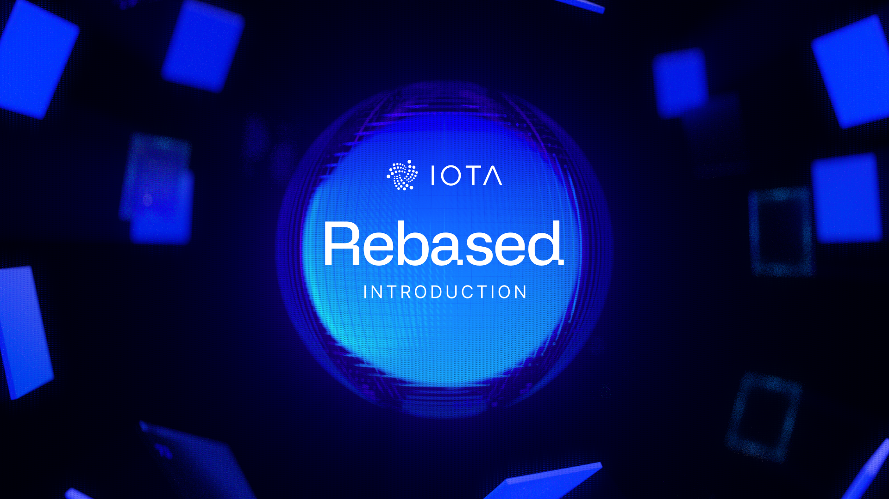
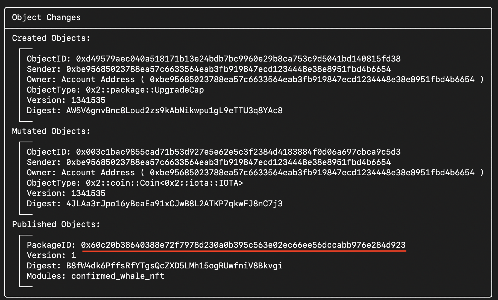
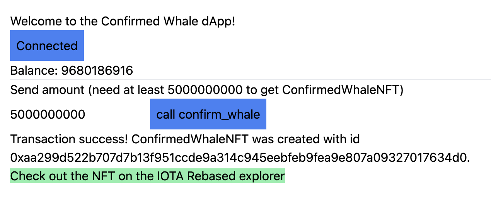

+++
title = "Smart Contracts on IOTA Rebased - an Introduction"
date = 2024-12-09
+++



With the upcoming [IOTA Rebased network upgrade](https://blog.iota.org/iota-rebased-fast-forward), the [Move](https://sui.io/move) smart contract programming language is coming to IOTA. The goal of this article is to show you how you can get a simple dApp (decentralized application) written in Move up and running quickly. We will write and publish a ***Move smart contract*** on the IOTA Rebased testnet, and create a frontend to interact with it using [***Svelte***](https://svelte.dev).

The code for this article can be found [here](https://github.com/teunvw14/iota-rebased-sc-minimal-example).

# Who is this article for?

This article is for developers who want to get a feeling for writing smart contracts with Move on IOTA. Some previous programming experience is required; familiarity with Rust (similar to Move) and TypeScript (for the frontend) will help a lot.

# Prerequisites

Before we can get started, make sure you have installed the following:

- [IOTA CLI](https://github.com/iotaledger/iota/) - installing one of [the pre-built binaries](https://docs.iota.org/developer/getting-started/install-iota#install-from-binaries) is strongly recommended
- [node/npm](https://nodejs.org/en/download/package-manager)
- Strongly recommended: Using Visual Studio Code with the [IOTA Move extension](https://marketplace.visualstudio.com/items?itemName=iotaledger.iota-move)


# Writing a smart contract with Move

Alright, let's get to writing a smart contract. To keep things very simple, we will create a smart contract that sends a `ConfirmedWhaleNFT` to anyone that interacts with the smart contract and proves that they have more than 5 IOTA. 

The smart contract will work as follows: the user can send a `Coin<IOTA>` object to the smart contract, which the smart contract will then immediately return to the sender. (In IOTA Move, IOTA tokens are represented as `Coin<IOTA>` objects, which can hold any number of IOTA tokens.) If the `Coin` object contains at least 5 IOTA, we will also create and send a `ConfirmedWhaleNFT` to the user. If the `Coin` object contains too little funds, the user will not receive a `ConfirmedWhaleNFT`. You can think of this NFT as a "proof of funds" NFT.

Let's start out by creating our project using the `iota` CLI. We'll call our package `confirmed_whale_nft`. 

```bash
$ iota move new confirmed_whale_nft
```

This should create a folder `confirmed_whale_nft`. Open this folder in your preferred code editor. Now open up the file `sources/confirmed_whale_nft.move`. This is where we will be writing our smart contract. Let's start out by defining the `ConfirmedWhaleNFT` object that we will be sending to users.

```rust
// confirmed_whale_nft.move
module confirmed_whale_nft::confirmed_whale_nft {
    public struct ConfirmedWhaleNFT has key {
        id: UID,
        owner: address
    }
}
```

This should look pretty familiar if you've ever worked with a typed programming language before. The expression `has key` let's the MoveVM know that the `confirmed_whale_nft` is a Move object. Because it's a Move object, its first field needs to be of type `UID`, which is a globally unique object ID. 

Next, we have to add a way for users to get one of these NFT's. Let's create a function that lets the user do just that. We will need to import a few things from the standard library.

```rust
// confirmed_whale_nft.move
module confirmed_whale_nft::confirmed_whale_nft {
    use iota::iota::{IOTA};
    use iota::coin::{Coin};

    public struct ConfirmedWhaleNFT has key {...}

    // Send a ConfirmedWhaleNFT to the caller if they send along a coin with at
    // least 5 IOTA.
    public fun confirm_whale(coin: Coin<IOTA>, ctx: &mut TxContext) {
        let coin_value_iota = coin.value() / 1_000_000_000;
        let caller = ctx.sender();
        if (coin_value_iota >= 5) {
            let nft = ConfirmedWhaleNFT {
                id: object::new(ctx),
                owner: caller
            };
            transfer::transfer(nft, caller);
        };
        transfer::public_transfer(coin, caller);
    }
}
```
That's all for now! Simple right? 

A few notes on this code: 
- The base unit for IOTA Rebased is a NANO, which is one billionth of an IOTA (i.e. 1 IOTA = 1.000.000.000 NANO). That's why we have to divide the coin value by a billion to get the value in IOTA. 
- The `object::new(ctx)` is used to create a new globally unique object ID for our NFT. This is done at runtime when the transaction is executed. 
- There are quite a few modules imported by default, like `iota::tx_context`, `iota::transfer`, and `iota::object`, which is why we can use them without having to import them.

You can make sure that there are no errors in your code by building your smart contract:

```bash
$ iota move build
```

## Publishing the smart contract

Now that we've written our first smart contract, we will deploy it to the IOTA Rebased testnet, so that we can start seeing our code in action. To get started, we will first add and switch to the testnet environment for our IOTA Client CLI.

Add the testnet environment:
```bash
$ iota client new-env --alias=testnet --rpc https://api.testnet.iota.cafe:443
Added new IOTA env [testnet] to config.
```
Switching to the newly added testnet environment:
```bash
$ iota client switch --env testnet
Active environment switched to [testnet]
```

Now, to deploy the smart contract, we'll need some IOTA as gas. We can get some IOTA for free from the testnet faucet by calling: 

```bash
$ iota client faucet
Request successful. It can take up to 1 minute to get the coin. Run iota client gas to check your gas coins.
```

Now, to deploy our smart contract, in the folder `confirmed_whale_nft`:

```bash
$ iota client publish --gas-budget 100000000
```

If everything went well, the above command should print the results of the publishing our package. Under 'Object Changes'-'Published Objects', you should see your package with `Modules: confirmed_whale_nft` (see image below). *Make sure to copy the `PackageID`, since we will need it later to interact with our smart contract.*



# Creating a frontend

Now, let's create a frontend to interact with our smart contract. We will use [Svelte/SvelteKit](https://svelte.dev/docs/kit/introduction). The frontend will be very minimal, but it should illustrate how a frontend that interacts with a Move smart contract.

## Setup

Let's start by creating the frontend project using `npx`. The recommended installation options are shown below.

```bash
$ npx sv create confirmed_whale_nft_frontend
◇  Which template would you like?
│  SvelteKit minimal
│
◇  Add type checking with Typescript?
│  Yes, using Typescript syntax
│
◆  Project created
│
◇  What would you like to add to your project? (use arrow keys / space bar)
│  tailwindcss
│
◇  Which plugins would you like to add?
│  none
│
◇  Which package manager do you want to install dependencies with?
│  npm
│  ...
└  You're all set!

$ cd confirmed_whale_nft_frontend
```

Let's install some dependencies. We will need the `iota-sdk` to interact with the IOTA Rebased testnet, and to interact with the smart contract. We will need the Mysten `wallet-standard` to interact with end-user wallets. 

```bash
$ npm install @iota/iota-sdk @mysten/wallet-standard 
```

Now, there's one last thing that we have to do before we can start creating our frontend. Create a component `src/lib/ConfirmedWhaleInterface.svelte`, and then replace the contents inside `src/routes/+page.svelte` so that it only holds this component:

```html
<!-- src/routes/+page.svelte -->
<script>
    import ConfirmedWhaleInterface from "$lib/ConfirmedWhaleInterface.svelte";
</script>

<ConfirmedWhaleInterface />
```

This `ConfirmedWhaleInterface` component will hold all the HTML and TypeScript for our frontend.

## Creating the frontend

To make things easier, make sure to start up a live server.

```bash
npm run dev -- --open
```

Let's start out by defining a few visual components using HTML / Svelte in our `ConfirmedWhaleInterface`.

```html
<!-- src/lib/ConfirmedWhaleInterface.svelte -->

<div class="m-4">

    <h1>
        Welcome to the Confirmed Whale dApp!
    </h1>

    <!-- Button for connecting to an IOTA wallet -->
    <button 
        onclick={connectWallet}
        class="bg-blue-500 p-2"
    >
        {activeWallet ? 'Connected' : 'Connect wallet'}
    </button>

    <!-- Display for the balance of the active walletAccount -->
    <p>{activeWalletAccount ? `Balance: ${activeWalletAccountBalance}` : 'Connect a wallet to show balance'}</p>

    <hr/>

    <!-- Input for how many NANOs to send to the smart contract -->
    <h3>Send amount (need at least 5000000000 to get ConfirmedWhaleNFT)</h3>
    <input bind:value={sendAmountNanos} type="number" lang="en" step="1"/>

    <!-- Button that allows for interaction with the smart contract -->
    <button 
        onclick={confirmWhale}
        class="bg-blue-500 p-2"
        disabled={!activeWalletAccount}
    >
        {activeWalletAccount ? "call confirm_whale" : "Connect a wallet to interact with smart contract."}
    </button>

    <!-- Display of the result of the transaction -->
    <p>{resultText}</p>
    <a 
        href={explorerUrl} target="_blank"
        class="bg-green-300"
    >
        {explorerUrl == "" ? "" : "Check out the NFT on the IOTA Rebased explorer"}
    </a>

</div>
```

The HTML is (hopefully) pretty self-explanatory. Now let's look at the relevant TypeScript and see how the actual logic for interacting with our smart contract is defined. We begin by importing the relevant libraries, defining the relevant constants, and defining the state variables used in our app. Next important thing is to initialize the IOTA Client for the testnet. We will use it to send transactions.

```html
<!-- src/lib/ConfirmedWhaleInterface.svelte -->

<script lang="ts">
    import type { Wallet, WalletAccount } from '@mysten/wallet-standard';
    import { getWallets } from '@mysten/wallet-standard';
    import { getFullnodeUrl, IotaClient } from '@iota/iota-sdk/client';
    import { Transaction } from '@iota/iota-sdk/transactions';
    
    let PACKAGE_ID = "YOUR_PACKAGE_ID_HERE";
    let MODULE_NAME = "confirmed_whale_nft";
    let FUNCTION_NAME = "confirm_whale";
    let GAS_BUDGET = 100_000_000;
    
    let activeWallet = $state(null);
    let activeWalletAccount = $state(null);
    let activeWalletAccountBalance = $state(0);
    let sendAmountNanos = $state(0);
    let resultText = $state("");
    let explorerUrl = $state("");

    const iotaClient = new IotaClient({ url: getFullnodeUrl('testnet') });
    ...
</script>
```

Make sure you paste your PackageId in `PACKAGE_ID`. Of interest here may be the hardcoded `GAS_BUDGET`, set to 0.1 IOTA for simplicity. You can lower this if you want, but if you set the gas budget too low, transactions may fail. 

Additionally, you may wonder what the difference is between a `Wallet` and a `WalletAccount`. You can think of a `Wallet` as any app (browser extension or desktop app) that can manage your assets - and `WalletAccounts` as the addresses that are managed by a `Wallet`. A `Wallet` can have many different `WalletAccounts`.

Next, let's see how we can connect to an IOTA wallet.

```html
<!-- src/lib/ConfirmedWhaleInterface.svelte -->

<script>
    ...

    const iotaClient = new IotaClient({ url: getFullnodeUrl('testnet') });

    async function connectWallet() {
        let wallets = getWallets().get();
        if (wallets.length == 0) {
            console.log("No wallets found to connect to. Make sure you installed an IOTA web wallet.");
            return;
        }
        // Make sure we get the right wallet
        activeWallet = wallets.find((w) => w.name == "IOTA Wallet");
        if (!activeWallet) {
            console.log("No IOTA wallets found to connect to. Make sure you installed an IOTA web wallet.");
            return;
        }
        activeWallet.features['standard:connect'].connect();
        activeWallet.features['standard:events'].on("change", () => {
            activeWalletAccount = activeWallet.accounts[0];
            updateBalance();
        });
    }

    // Helper function to update the balance of the activeWalletAccount
    async function updateBalance() {
        if (activeWalletAccount) {
            activeWalletAccountBalance = (await iotaClient.getBalance({owner: activeWalletAccount.address})).totalBalance;
        }
    }

    ...
</script>
```

When an error occurs while trying to connect to a wallet, we will just write to the console what went wrong and return. There's are a few things that can go wrong in the process of connecting - in a real dApp you would probably want to do more robust error handling. For now we will keep things simple.

When we call `activeWallet.features['standard:connect'].connect()`, the wallet will present the user with the connection request and ask them to approve it. We don't know how long the user will take to approve the request, so we add the event listener that sets `activeWalletAccount` and updates the balance when any 'change' happens on the wallet. The wallet successfully connecting is such a 'change'. 

Now we're almost done - the only thing left to do is to add the logic for calling our smart contract function. Let's walk through it. 

We will start out by creating the transaction and creating a `Coin<IOTA>` object by splitting it from the gas `Coin`. 

```html
<!-- src/lib/ConfirmedWhaleInterface.svelte -->

<script>
    ...

    // Send a transaction to the smart contract, calling `confirm_whale`.
    async function confirmWhale() {

        // Set up the transaction
        let tx = new Transaction();
        tx.setGasBudget(GAS_BUDGET);

        let [coin] = tx.splitCoins(tx.gas, [sendAmountNanos]);
        tx.moveCall({
            package: PACKAGE_ID,
            module: MODULE_NAME,
            function: FUNCTION_NAME,
            arguments: [tx.object(coin)],
        });
    }
    ...
</script>
```
The meat of the function is in the `tx.moveCall()`. This is saying that we want to call the `confirm_whale` Move function with our `coin` as an argument. 

Now that we defined what we want the transaction to do, we need the user to sign the transaction with the wallet, so that it can be executed.

```js
// Send a transaction to the smart contract, calling `confirm_whale`.
async function confirmWhale() {
    ...

    // Request the wallet to sign the transaction
    let {bytes, signature} = 
    await (activeWallet.features['iota:signTransaction']).signTransaction({
        transaction: tx, 
        account: activeWalletAccount,
    });

    // Send signed transaction to the network for execution
    let transactionResult = await iotaClient.executeTransactionBlock({
        transactionBlock: bytes,
        signature: signature,
    })
}
```

Here again, in a real dApp you would probably want to add proper error handling. For example, the user refusing to sign the transaction should be handled gracefully. But that's outside the scope of this article.

The last part of this function deals with the result of executing the transaction. We will have to wait for the transaction to be final on the network, after which we can get the relevant `transactionBlock` using the transaction digest. The last part of the code makes sure that the result of the transaction is shown to the user. The `explorerUrl` is updated so that a link to the created `ConfirmedWhaleNFT` is shown.

```js
// Send a transaction to the smart contract, calling `confirm_whale`.
async function confirmWhale() {
    ...

    // Wait for transaction to complete and parse results
    await iotaClient.waitForTransaction({ digest: transactionResult.digest });

    let transactionBlock = await iotaClient.getTransactionBlock({
        digest: transactionResult.digest,
        options: {
            showEffects: true,
            showObjectChanges: true,
        }
    });

    // Show transaction results, if the transaction was successful
    if (transactionBlock.effects?.status.status == 'success'){
        let confirmedWhaleNftCreated = transactionBlock.objectChanges?.find((change) => {
            return change.objectType.endsWith("::confirmed_whale_nft::ConfirmedWhaleNFT")
        });
        if (confirmedWhaleNftCreated) {
            resultText = `Transaction success! ConfirmedWhaleNFT was created with id ${confirmedWhaleNftCreated.objectId}.`;
            explorerUrl = `https://explorer.rebased.iota.org/object/${confirmedWhaleNftCreated.objectId}`;
        } else {
            resultText = "Transaction succeeded, but ConfirmedWhaleNFT was not created.";
        }
    }
}
```

That's it! Our smart contract with frontend is now complete. Your frontend should look something like this:




Of course there are a bunch of things that could be improved: the frontend design, improved smart contract functionality, error handling, testing, etc.. But that's for another article. 

For now, I hope that you learned something and are ready to write your own dApps. If you want to continue learning, consider taking a look at [this article](../iota-move-raffle-tutorial/), which will show you how to create a raffle smart contract with Move. 

Thanks for reading!

For the full code, check out the [accompanying github repository](https://github.com/teunvw14/iota-rebased-sc-minimal-example).